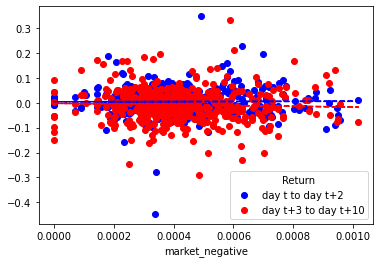

```python
import fnmatch
import glob
import os
import warnings
import zipfile
from time import sleep

import pandas as pd
from sec_edgar_downloader import Downloader
from tqdm import tqdm

warnings.filterwarnings(
    "ignore",
    message="It looks like you're parsing an XML document using an HTML parser",
)
```


```python
os.makedirs("inputs", exist_ok=True)
os.makedirs("10k_files", exist_ok=True)
```


```python
from datetime import datetime
from io import BytesIO
from urllib.request import urlopen
from zipfile import ZipFile

import pandas_datareader as pdr
import yfinance as yf
```


```python
sp500_file = "inputs/sp500_2022.csv"

if not os.path.exists(sp500_file):
    url = "https://en.wikipedia.org/wiki/List_of_S%26P_500_companies"
    pd.read_html(url)[0].to_csv(sp500_file, index=False)

sp500 = pd.read_csv("inputs/sp500_2022.csv")
```


```python
stock = sp500["Symbol"].to_list()
```


```python
url = "https://github.com/LeDataSciFi/data/blob/main/Stock%20Returns%20(CRSP)/crsp_2022_only.zip?raw=true"

with urlopen(url) as request:
    data = BytesIO(request.read())

with ZipFile(data) as archive:
    with archive.open(archive.namelist()[0]) as stata:
        ret = pd.read_stata(stata)

ret
```


<div>
<style scoped>
    .dataframe tbody tr th:only-of-type {
        vertical-align: middle;
    }

    .dataframe tbody tr th {
        vertical-align: top;
    }

    .dataframe thead th {
        text-align: right;
    }
</style>
<table border="1" class="dataframe">
  <thead>
    <tr style="text-align: right;">
      <th></th>
      <th>ticker</th>
      <th>date</th>
      <th>ret</th>
    </tr>
  </thead>
  <tbody>
    <tr>
      <th>0</th>
      <td>JJSF</td>
      <td>2021-12-01</td>
      <td>-0.011276</td>
    </tr>
    <tr>
      <th>1</th>
      <td>JJSF</td>
      <td>2021-12-02</td>
      <td>0.030954</td>
    </tr>
    <tr>
      <th>2</th>
      <td>JJSF</td>
      <td>2021-12-03</td>
      <td>0.000287</td>
    </tr>
    <tr>
      <th>3</th>
      <td>JJSF</td>
      <td>2021-12-06</td>
      <td>0.014362</td>
    </tr>
    <tr>
      <th>4</th>
      <td>JJSF</td>
      <td>2021-12-07</td>
      <td>0.012459</td>
    </tr>
    <tr>
      <th>...</th>
      <td>...</td>
      <td>...</td>
      <td>...</td>
    </tr>
    <tr>
      <th>2587061</th>
      <td>TSLA</td>
      <td>2022-12-23</td>
      <td>-0.017551</td>
    </tr>
    <tr>
      <th>2587062</th>
      <td>TSLA</td>
      <td>2022-12-27</td>
      <td>-0.114089</td>
    </tr>
    <tr>
      <th>2587063</th>
      <td>TSLA</td>
      <td>2022-12-28</td>
      <td>0.033089</td>
    </tr>
    <tr>
      <th>2587064</th>
      <td>TSLA</td>
      <td>2022-12-29</td>
      <td>0.080827</td>
    </tr>
    <tr>
      <th>2587065</th>
      <td>TSLA</td>
      <td>2022-12-30</td>
      <td>0.011164</td>
    </tr>
  </tbody>
</table>
<p>2587066 rows × 3 columns</p>
</div>


## Get filing date


```python
import fnmatch
import glob
import os
import re
from time import sleep
from zipfile import ZipFile

import numpy as np
import pandas as pd
from bs4 import BeautifulSoup
from near_regex import NEAR_regex  # copy this file into the asgn folder
from requests_html import HTMLSession
from tqdm import tqdm  # progress bar on loops
```


```python
import os

directory_path = "10k_files/sec-edgar-filings"

file_name = os.listdir(directory_path)

# print(file_name)

company_ids = []

for folder in os.listdir(directory_path):
    folder_path = os.path.join(directory_path, folder)
    if os.path.isdir(folder_path):
        ten_k_path = os.path.join(folder_path, "10-k")
        if os.path.isdir(ten_k_path):
            for subfolder in os.listdir(ten_k_path):
                subfolder_path = os.path.join(ten_k_path, subfolder)
                if os.path.isdir(subfolder_path):
                    match = re.search(r"\d+-\d+-\d+", subfolder)
                    if match:
                        company_id = match.group()
                        company_ids.append(company_id)
print(company_ids)
```

    ['0000046619-22-000066', '0000006201-22-000026', '0001158449-22-000037', '0000320193-22-000108', '0001551152-22-000007', '0001140859-22-000098', '0001104659-22-025141', '0000947484-22-000015', '0001467373-22-000295', '0000796343-22-000032', '0000006281-22-000250', '0001437749-22-016896', '0000008670-22-000038', '0000769397-22-000019', '0001002910-22-000038', '0001775098-22-000009', '0000874761-22-000022', '0000004977-22-000058', '0001104659-22-024701', '0001267238-22-000006', '0001564590-22-005714', '0001086222-22-000058', '0000915913-22-000027', '0001097149-22-000011', '0000766421-22-000009', '0001477932-22-009557', '0001579241-22-000019', '0000006951-22-000043', '0001748790-22-000024', '0000002488-22-000016', '0001037868-22-000009', '0000318154-22-000010', '0000820027-22-000016', '0001053507-22-000017', '0001018724-22-000005', '0001596532-22-000026', '0001013462-22-000005', '0001068238-22-000091', '0000091142-22-000028', '0001784031-22-000009', '0000002969-22-000054', '0001558370-22-000961', '0001521332-22-000010', '0001035443-22-000040', '0000731802-22-000037', '0001628280-22-003992', '0000915912-22-000005', '0001730168-22-000118', '0001193125-22-049910', '0001410636-22-000048', '0000004962-22-000008', '0001558370-22-015239', '0001140361-22-011126', '0000070858-22-000062', '0001558370-22-001251', '0001628280-22-003432', '0000701985-22-000009', '0000764478-22-000008', '0001628280-22-030686', '0000038777-22-000198', '0001144519-22-000017', '0000875045-22-000007', '0001558370-22-013935', '0001654954-22-003300', '0001075531-22-000008', '0001701605-22-000050', '0001564590-22-007117', '0000014272-22-000051', '0001383312-22-000037', '0000950170-22-001654', '0000885725-22-000006', '0000908255-22-000009', '0001656423-22-000013', '0001193125-22-185015', '0001437749-22-017530', '0000721371-22-000058', '0001783180-22-000010', '0001554795-22-000255', '0001605301-22-000008', '0001558370-22-001386', '0001138118-22-000010', '0001051470-22-000019', '0000815097-22-000009', '0000950170-22-002143', '0000813672-22-000012', '0001402057-22-000020', '0001306830-22-000017', '0001868275-22-000020', '0001213900-22-016814', '0000759944-22-000025', '0001564590-22-005528', '0001043277-22-000006', '0001091667-22-000024', '0001739940-22-000007', '0000020286-22-000012', '0000021665-22-000003', '0000021076-22-000026', '0000028412-22-000067', '0001166691-22-000009', '0001156375-22-000076', '0001017386-22-000095', '0000026172-22-000008', '0000811156-22-000048', '0001071739-22-000071', '0001130310-22-000023', '0000927628-22-000106', '0000711404-22-000053', '0001562762-22-000031', '0000909832-22-000021', '0000016732-22-000093', '0000900075-22-000050', '0000906345-22-000009', '0001100682-22-000007', '0001108524-22-000013', '0000858877-22-000013', '0001057352-22-000027', '0000277948-22-000009', '0000723254-22-000019', '0001596783-22-000129', '0000858470-22-000009', '0001058290-22-000023', '0001755672-22-000005', '0000064803-22-000008', '0000093410-22-000019', '0001590895-22-000061', '0000882184-22-000184', '0000027904-22-000003', '0001666700-22-000009', '0000771497-22-000028', '0001393612-22-000007', '0001558370-22-003921', '0001022079-22-000027', '0000882184-22-000184', '0000313616-22-000061', '0001744489-22-000213', '0001558370-22-003448', '0001558370-22-002195', '0000935703-22-000020', '0000029905-22-000009', '0001751788-22-000011', '0000950170-22-002426', '0000074046-22-000072', '0000936340-22-000077', '0001326160-22-000072', '0000927066-22-000012', '0001564590-22-005321', '0001688568-22-000027', '0001093557-22-000014', '0000712515-22-000011', '0001065088-22-000006', '0001558370-22-002059', '0001047862-22-000039', '0000033185-22-000014', '0000827052-22-000006', '0001001250-22-000122', '0000915389-22-000010', '0000032604-22-000041', '0001463101-22-000016', '0000821189-22-000017', '0001352010-22-000020', '0001628280-22-003171', '0001564590-22-005566', '0000033213-22-000007', '0000072741-22-000015', '0001628280-22-005026', '0001551182-22-000004', '0000065984-22-000017', '0001370637-22-000024', '0001711269-22-000008', '0001099800-22-000005', '0001109357-22-000039', '0001564590-22-010381', '0001324424-22-000009', '0001628280-22-004274', '0000103379-22-000006', '0001539838-22-000008', '0001193125-22-106571', '0000831259-22-000009', '0001013237-22-000159', '0000950170-22-012762', '0001096906-22-002483', '0001048695-22-000033', '0000814547-22-000016', '0001136893-22-000038', '0000798354-22-000004', '0000035527-22-000119', '0001628280-22-004531', '0000037785-22-000025', '0001628280-22-022584', '0001628280-22-022584', '0000034903-22-000023', '0001274494-22-000009', '0001262039-22-000008', '0001659166-22-000054', '0000040533-22-000007', '0000040545-22-000008', '0001558370-21-003091', '0000882095-22-000007', '0001193125-22-185257', '0000320335-22-000006', '0001437749-22-003247', '0001213900-22-015103', '0001437749-22-004080', '0001652044-22-000019', '0001652044-22-000019', '0000040987-22-000013', '0001123360-22-000007', '0000950170-22-001303', '0001853620-22-000111', '0000277135-22-000012', '0000045012-22-000013', '0000046080-22-000023', '0000049196-22-000023', '0001193125-22-046707', '0000354950-22-000070', '0001628280-22-004524', '0000874766-22-000019', '0001501585-22-000007', '0001585689-22-000013', '0000859737-22-000022', '0000773840-22-000018', '0001645590-22-000071', '0000047217-22-000068', '0000048465-22-000051', '0001000228-22-000016', '0001674796-22-000007', '0000047111-22-000017', '0000049071-22-000017', '0000004281-22-000004', '0001558370-22-001584', '0001683168-22-001684', '0000874716-22-000007', '0000832101-22-000008', '0000051253-22-000007', '0001110803-22-000013', '0001558370-22-000902', '0000050863-22-000007', '0000896878-22-000028', '0001687229-22-000002', '0001393905-22-000407', '0001111928-22-000025', '0001478242-22-000041', '0001493152-22-008516', '0001020569-22-000035', '0001035267-22-000014', '0001213900-22-012344', '0000049826-22-000006', '0000914208-22-000319', '0001437749-22-027923', '0001437749-22-004457', '0000833444-22-000043', '0000779152-22-000076', '0000200406-22-000022', '0001043604-22-000017', '0000019617-22-000272', '0001628280-22-003345', '0001418135-22-000005', '0000719733-22-000063', '0001601046-22-000161', '0001637459-22-000018', '0001437749-22-004700', '0000319201-22-000023', '0000055785-22-000010', '0001506307-22-000018', '0001170010-22-000017', '0000021344-22-000009', '0001558370-22-004595', '0001558370-22-014733', '0001336920-22-000007', '0001628280-22-001450', '0000920148-22-000015', '0000202058-22-000015', '0001628280-22-004180', '0001065696-22-000006', '0000059478-22-000068', '0000936468-22-000008', '0000059558-22-000008', '0000352541-22-000020', '0000060667-22-000038', '0000707549-22-000107', '0000092380-22-000007', '0001300514-22-000007', '0001558370-22-011121', '0001489393-22-000009', '0001335258-22-000019', '0000356037-22-000036', '0000950170-22-001423', '0001628280-22-002666', '0000062996-22-000011', '0000063908-22-000011', '0000827054-22-000094', '0000927653-22-000051', '0001059556-22-000012', '0001103982-22-000003', '0001613103-22-000023', '0001691303-22-000006', '0000950170-22-002601', '0000789570-22-000005', '0000851968-22-000026', '0000063754-22-000005', '0000950170-22-001811', '0001564590-22-005965', '0000062709-22-000009', '0000066740-22-000010', '0001104659-22-028182', '0000764180-22-000019', '0001179929-22-000025', '0001618034-22-000004', '0001510295-22-000011', '0001437749-22-004460', '0000310158-22-000003', '0001682852-22-000012', '0000101778-22-000016', '0001437749-22-007177', '0001564590-22-004803', '0001564590-22-026876', '0000068505-22-000010', '0001564590-22-005400', '0000891103-22-000020', '0001037646-22-000008', '0001493152-22-029911', '0001558370-22-002516', '0001120193-22-000007', '0000072331-22-000185', '0000753308-22-000014', '0001164727-22-000007', '0001065280-22-000036', '0001174947-22-000353', '0000320187-22-000038', '0001133421-22-000004', '0000950170-22-001400', '0001013871-22-000010', '0000702165-22-000007', '0000950170-22-011708', '0000073124-22-000071', '0001564590-22-007679', '0001045810-22-000036', '0000906163-22-000008', '0000814453-22-000017', '0001564708-22-000265', '0001564708-22-000265', '0001413447-22-000008', '0001654954-22-003978', '0001564590-22-006303', '0001821825-22-000002', '0001039684-22-000015', '0000029989-22-000012', '0001477932-22-004928', '0001564590-22-023675', '0000898173-22-000012', '0001781335-22-000007', '0000797468-22-000008', '0000813828-22-000005', '0001564590-22-005562', '0000950170-22-012734', '0001564590-22-006237', '0001004980-22-000009', '0001199835-22-000838', '0001628280-22-003860', '0000077476-22-000010', '0000078003-22-000027', '0001104659-22-020401', '0000080424-22-000064', '0000080661-22-000046', '0000076334-22-000034', '0000822416-22-000007', '0000950170-22-001913', '0000031791-22-000003', '0001564590-22-004436', '0001437749-22-004700', '0000713676-22-000019', '0000077360-22-000006', '0000764622-22-000014', '0001145197-22-000012', '0000945841-22-000023', '0000079879-22-000009', '0000922224-22-000005', '0001137774-22-000038', '0001393311-22-000010', '0001534701-22-000078', '0000950170-22-025211', '0001050915-22-000008', '0001038357-22-000039', '0001633917-22-000027', '0000804328-22-000021', '0001604778-22-000029', '0000884887-22-000008', '0001654954-22-004186', '0000950170-22-001418', '0001804220-22-000007', '0001437749-22-007905', '0000315213-22-000018', '0000720005-22-000066', '0001037038-22-000014', '0000943819-22-000010', '0001024478-22-000093', '0000084839-22-000011', '0000882835-22-000012', '0000745732-22-000014', '0001060391-22-000007', '0000101829-22-000005', '0001034054-22-000002', '0000829224-22-000058', '0000316709-22-000009', '0001178913-22-000760', '0001628280-22-003294', '0000089800-22-000007', '0000091419-22-000049', '0001564590-22-002421', '0000091440-22-000005', '0000883241-22-000017', '0000092122-22-000003', '0001558370-22-001845', '0000064040-22-000055', '0001032208-22-000007', '0001757898-22-000011', '0001558370-22-002377', '0000093751-22-000424', '0001137789-22-000055', '0000016918-22-000069', '0001552781-22-000279', '0000004127-22-000038', '0001601712-22-000053', '0000310764-22-000028', '0000096021-22-000151', '0001477932-22-007727', '0000024545-22-000005', '0001260221-22-000065', '0001094285-22-000049', '0000831641-22-000123', '0001558370-22-017931', '0001193125-22-049828', '0000092230-22-000008', '0000096943-22-000016', '0000027419-22-000007', '0000109198-22-000008', '0000097745-22-000011', '0001283699-22-000018', '0001116132-22-000018', '0001564590-22-006563', '0000864749-22-000044', '0001113169-22-000005', '0000086312-22-000013', '0000916365-22-000049', '0000950170-22-000796', '0000100493-22-000097', '0001466258-22-000031', '0001628280-22-014580', '0000097476-22-000009', '0000217346-22-000005', '0000860731-22-000011', '0000100517-22-000009', '0000074208-22-000010', '0001564590-22-006717', '0001558370-22-004330', '0000731766-22-000008', '0001437749-22-002494', '0001090727-22-000007', '0001067701-22-000008', '0001193125-22-048709', '0001403161-22-000081', '0000103379-22-000006', '0001705696-22-000046', '0001035002-22-000007', '0001396009-22-000010', '0001437749-22-004083', '0001014473-22-000007', '0000875320-22-000007', '0000740260-22-000057', '0001792044-22-000010', '0000732712-22-000008', '0001628280-22-002997', '0001193125-22-051509', '0001618921-22-000064', '0000106040-22-000055', '0000107815-22-000116', '0000950170-22-005071', '0000072971-22-000096', '0000106640-22-000015', '0001779474-22-000010', '0000107263-22-000007', '0000104169-22-000012', '0000011544-22-000007', '0000950170-22-025444', '0001628280-22-003342', '0000950170-22-001932', '0001903596-22-000695', '0001174922-22-000031', '0000072903-22-000010', '0000034088-22-000011', '0000818479-22-000015', '0001524472-22-000009', '0001564590-22-007640', '0001564590-22-007160', '0000877212-22-000026', '0001213900-22-013250', '0001555280-22-000078']
    


```python
data = []
accession_number = {"Accession_number": company_ids, "Symbol": file_name}
data.append(accession_number)
accession_number = pd.DataFrame(accession_number)
```


```python
sp = sp500.merge(accession_number, how="inner")
```


```python
sp.columns
```


    Index(['Symbol', 'Security', 'GICS Sector', 'GICS Sub-Industry',
           'Headquarters Location', 'Date added', 'CIK', 'Founded',
           'Accession_number'],
          dtype='object')


```python
from bs4 import BeautifulSoup
from requests_html import HTMLSession

session = HTMLSession()
data2 = []
for i, row in sp.iterrows():
    firm = row["Symbol"]
    firm_name = row["Security"]
    cik = row["CIK"]
    accession_number = row["Accession_number"]

    url = f"https://www.sec.gov/Archives/edgar/data/{cik}/{accession_number}-index.html"
    r = session.get(url)
    soup = BeautifulSoup(r.text, "html.parser")
    filing_date = (soup.find("div", text="Filing Date").find_next_sibling("div").text.strip())
    # filing_date=r.html.find('div.formGrouping:nth-child(1)>div:nth-child(2)',first=True).text
    data2.append(
        {
            "Symbol": firm,
            "Security": firm_name,
            "CIK": cik,
            "Accession_Num": accession_number,
            "filing_date": filing_date,
        }
    )
filing_datedf = pd.DataFrame(data2)
```


```python
df1 = filing_datedf
df1
```


<div>
<style scoped>
    .dataframe tbody tr th:only-of-type {
        vertical-align: middle;
    }

    .dataframe tbody tr th {
        vertical-align: top;
    }

    .dataframe thead th {
        text-align: right;
    }
</style>
<table border="1" class="dataframe">
  <thead>
    <tr style="text-align: right;">
      <th></th>
      <th>Symbol</th>
      <th>Security</th>
      <th>CIK</th>
      <th>Accession_Num</th>
      <th>filing_date</th>
    </tr>
  </thead>
  <tbody>
    <tr>
      <th>0</th>
      <td>MMM</td>
      <td>3M</td>
      <td>66740</td>
      <td>0000066740-22-000010</td>
      <td>2022-02-09</td>
    </tr>
    <tr>
      <th>1</th>
      <td>AOS</td>
      <td>A. O. Smith</td>
      <td>91142</td>
      <td>0000091142-22-000028</td>
      <td>2022-02-11</td>
    </tr>
    <tr>
      <th>2</th>
      <td>ABT</td>
      <td>Abbott</td>
      <td>1800</td>
      <td>0001104659-22-025141</td>
      <td>2022-02-18</td>
    </tr>
    <tr>
      <th>3</th>
      <td>ABBV</td>
      <td>AbbVie</td>
      <td>1551152</td>
      <td>0001551152-22-000007</td>
      <td>2022-02-18</td>
    </tr>
    <tr>
      <th>4</th>
      <td>ACN</td>
      <td>Accenture</td>
      <td>1467373</td>
      <td>0001467373-22-000295</td>
      <td>2022-10-12</td>
    </tr>
    <tr>
      <th>...</th>
      <td>...</td>
      <td>...</td>
      <td>...</td>
      <td>...</td>
      <td>...</td>
    </tr>
    <tr>
      <th>492</th>
      <td>YUM</td>
      <td>Yum! Brands</td>
      <td>1041061</td>
      <td>0001564590-22-007640</td>
      <td>2022-02-28</td>
    </tr>
    <tr>
      <th>493</th>
      <td>ZBRA</td>
      <td>Zebra Technologies</td>
      <td>877212</td>
      <td>0000877212-22-000026</td>
      <td>2022-02-10</td>
    </tr>
    <tr>
      <th>494</th>
      <td>ZBH</td>
      <td>Zimmer Biomet</td>
      <td>1136869</td>
      <td>0001564590-22-007160</td>
      <td>2022-02-25</td>
    </tr>
    <tr>
      <th>495</th>
      <td>ZION</td>
      <td>Zions Bancorporation</td>
      <td>109380</td>
      <td>0001213900-22-013250</td>
      <td>2022-03-17</td>
    </tr>
    <tr>
      <th>496</th>
      <td>ZTS</td>
      <td>Zoetis</td>
      <td>1555280</td>
      <td>0001555280-22-000078</td>
      <td>2022-02-15</td>
    </tr>
  </tbody>
</table>
<p>497 rows × 5 columns</p>
</div>


# Do the sentiment Analysis


```python
import fnmatch
import re
from zipfile import ZipFile

import pandas as pd
from bs4 import BeautifulSoup

# create an empty DataFrame
df = pd.DataFrame()

with ZipFile("10k_files/10k_files.zip", "r") as zipfolder:

    # before the loop, get list of files in zipped folder
    file_list = zipfolder.namelist()

    # loop over rows in file_name DataFrame
    for index, row in df1.iterrows():

        firm = row["Symbol"]

        # get a list of possible files for this firm
        firm_folder = "sec-edgar-filings/" + firm + "/10-K/*/*.html"
        possible_files = fnmatch.filter(file_list, firm_folder)
        if len(possible_files) == 0:
            continue

        fpath = possible_files[0]  # the first match is the path to the file

        # open the file (this is a little different!)
        with zipfolder.open(fpath) as report_file:
            html = report_file.read().decode(encoding="utf-8")
            soup = BeautifulSoup(html, "lxml-xml")
            for div in soup.find_all("div", {"style": "display:none"}):
                div.decompose()
            soup = soup.get_text()
            lower = soup.lower()
            no_punc = re.sub(r"\W", " ", lower)  # get rid of those weird symbol
            cleaned = re.sub(r"\s+", " ", no_punc)  # fill the blank range

                # add cleaned result as a new row to the DataFrame using df.loc
            df.loc[index, "firm"] = firm
            df.loc[index, "html"] = cleaned
```


```python
df
```


<div>
<style scoped>
    .dataframe tbody tr th:only-of-type {
        vertical-align: middle;
    }

    .dataframe tbody tr th {
        vertical-align: top;
    }

    .dataframe thead th {
        text-align: right;
    }
</style>
<table border="1" class="dataframe">
  <thead>
    <tr style="text-align: right;">
      <th></th>
      <th>firm</th>
      <th>html</th>
    </tr>
  </thead>
  <tbody>
    <tr>
      <th>0</th>
      <td>MMM</td>
      <td>mmm 20211231table of contentsunited statessec...</td>
    </tr>
    <tr>
      <th>1</th>
      <td>AOS</td>
      <td>aos 20211231united states securities and exch...</td>
    </tr>
    <tr>
      <th>2</th>
      <td>ABT</td>
      <td>0000001800 12 312021fyfalsehttp fasb org us ga...</td>
    </tr>
    <tr>
      <th>3</th>
      <td>ABBV</td>
      <td>abbv 20211231united statessecurities and exch...</td>
    </tr>
    <tr>
      <th>4</th>
      <td>ACN</td>
      <td>acn 20220831table of contentsunited states se...</td>
    </tr>
    <tr>
      <th>...</th>
      <td>...</td>
      <td>...</td>
    </tr>
    <tr>
      <th>492</th>
      <td>YUM</td>
      <td>yumc 10k_20211231 htm united states securitie...</td>
    </tr>
    <tr>
      <th>493</th>
      <td>ZBRA</td>
      <td>zbra 20211231table of contentsunited statesse...</td>
    </tr>
    <tr>
      <th>494</th>
      <td>ZBH</td>
      <td>zbh 10k_20211231 htm i have united states sec...</td>
    </tr>
    <tr>
      <th>495</th>
      <td>ZION</td>
      <td>united states securities and exchange commiss...</td>
    </tr>
    <tr>
      <th>496</th>
      <td>ZTS</td>
      <td>zts 20211231table of contentsunited states se...</td>
    </tr>
  </tbody>
</table>
<p>497 rows × 2 columns</p>
</div>


```python
BHR_negative = pd.read_csv("inputs/ML_negative_unigram.txt", names=["word"])[
    "word"
].to_list()
```


```python
with open("inputs/ML_positive_unigram.txt", "r") as file:
    BHR_positive = [line.strip() for line in file]
```


```python
LM = pd.read_csv("inputs/LM_MasterDictionary_1993-2021.csv")
LM_negative = LM.query("Negative > 0")["Word"].to_list()
LM_positive = LM.query("Positive > 0")["Word"].to_list()
```


```python
BHR_positive[:20]
LM_negative[:20]
```


    ['ABANDON',
     'ABANDONED',
     'ABANDONING',
     'ABANDONMENT',
     'ABANDONMENTS',
     'ABANDONS',
     'ABDICATED',
     'ABDICATES',
     'ABDICATING',
     'ABDICATION',
     'ABDICATIONS',
     'ABERRANT',
     'ABERRATION',
     'ABERRATIONAL',
     'ABERRATIONS',
     'ABETTING',
     'ABNORMAL',
     'ABNORMALITIES',
     'ABNORMALITY',
     'ABNORMALLY']


```python
def sentiment_analysis(text):
    scores = [BHR_positive.count(word.lower()) for word in text.split()]
    positive_words = [score for score in scores if score > 0]
    return len(positive_words) / len(scores)


df["BHR_positive"] = df["html"].apply(sentiment_analysis)
```


```python
def calculate_sentiment_score(text, negative_words):
    text_words = text.lower().split()
    negative_word_count = sum([word.lower() in negative_words for word in text_words])
    return negative_word_count / len(text_words)


BHR_negative_set = set(BHR_negative)
df["BHR_negative"] = df["html"].apply(
    lambda x: calculate_sentiment_score(x, BHR_negative_set)
)
```


```python
def calculate_sentiment_score(text, negative_words):
    text_words = text.lower().split()
    negative_word_count = sum([word.lower() in negative_words for word in text_words])
    return negative_word_count / len(text_words)


LM_negative_set = set(list(map(lambda x: x.lower(), LM_negative)))
df["LM_negative"] = df["html"].apply(
    lambda x: calculate_sentiment_score(x, LM_negative_set)
)
```


```python
def calculate_sentiment_score(text, positive_words):
    text_words = text.lower().split()
    positive_word_count = sum([word.lower() in positive_words for word in text_words])
    return positive_word_count / len(text_words)


LM_positive_set = set(list(map(lambda x: x.lower(), LM_positive)))
df["LM_positive"] = df["html"].apply(
    lambda x: calculate_sentiment_score(x, LM_positive_set)
)
```


```python
df
```


<div>
<style scoped>
    .dataframe tbody tr th:only-of-type {
        vertical-align: middle;
    }

    .dataframe tbody tr th {
        vertical-align: top;
    }

    .dataframe thead th {
        text-align: right;
    }
</style>
<table border="1" class="dataframe">
  <thead>
    <tr style="text-align: right;">
      <th></th>
      <th>firm</th>
      <th>html</th>
      <th>BHR_positive</th>
      <th>BHR_negative</th>
      <th>LM_negative</th>
      <th>LM_positive</th>
    </tr>
  </thead>
  <tbody>
    <tr>
      <th>0</th>
      <td>MMM</td>
      <td>mmm 20211231table of contentsunited statessec...</td>
      <td>0.025683</td>
      <td>0.031662</td>
      <td>0.023249</td>
      <td>0.003977</td>
    </tr>
    <tr>
      <th>1</th>
      <td>AOS</td>
      <td>aos 20211231united states securities and exch...</td>
      <td>0.024460</td>
      <td>0.023602</td>
      <td>0.012984</td>
      <td>0.003756</td>
    </tr>
    <tr>
      <th>2</th>
      <td>ABT</td>
      <td>0000001800 12 312021fyfalsehttp fasb org us ga...</td>
      <td>0.021590</td>
      <td>0.024394</td>
      <td>0.012793</td>
      <td>0.003726</td>
    </tr>
    <tr>
      <th>3</th>
      <td>ABBV</td>
      <td>abbv 20211231united statessecurities and exch...</td>
      <td>0.019753</td>
      <td>0.022645</td>
      <td>0.015448</td>
      <td>0.006481</td>
    </tr>
    <tr>
      <th>4</th>
      <td>ACN</td>
      <td>acn 20220831table of contentsunited states se...</td>
      <td>0.027968</td>
      <td>0.023964</td>
      <td>0.016861</td>
      <td>0.008642</td>
    </tr>
    <tr>
      <th>...</th>
      <td>...</td>
      <td>...</td>
      <td>...</td>
      <td>...</td>
      <td>...</td>
      <td>...</td>
    </tr>
    <tr>
      <th>492</th>
      <td>YUM</td>
      <td>yumc 10k_20211231 htm united states securitie...</td>
      <td>0.025014</td>
      <td>0.023482</td>
      <td>0.016549</td>
      <td>0.006078</td>
    </tr>
    <tr>
      <th>493</th>
      <td>ZBRA</td>
      <td>zbra 20211231table of contentsunited statesse...</td>
      <td>0.028396</td>
      <td>0.026842</td>
      <td>0.014964</td>
      <td>0.006258</td>
    </tr>
    <tr>
      <th>494</th>
      <td>ZBH</td>
      <td>zbh 10k_20211231 htm i have united states sec...</td>
      <td>0.021506</td>
      <td>0.026759</td>
      <td>0.021783</td>
      <td>0.004591</td>
    </tr>
    <tr>
      <th>495</th>
      <td>ZION</td>
      <td>united states securities and exchange commiss...</td>
      <td>0.016075</td>
      <td>0.016980</td>
      <td>0.013458</td>
      <td>0.003070</td>
    </tr>
    <tr>
      <th>496</th>
      <td>ZTS</td>
      <td>zts 20211231table of contentsunited states se...</td>
      <td>0.021790</td>
      <td>0.033508</td>
      <td>0.019980</td>
      <td>0.005036</td>
    </tr>
  </tbody>
</table>
<p>497 rows × 6 columns</p>
</div>


```python
from near_regex import NEAR_regex
```

## Integrity words sentiment analysis


```python
positive_sentiment= ['(trustworthy|honest|transparent|ethical|reliable|accountable|authentic|principled|dependable|credible|sincere|genuine)']
negative_sentiment= ['(deceptive|fraudulent|dishonest|corrupt|unethical|unreliable|unaccountable|inauthentic|unprincipled|suspicious|dubious|misleading)']
```


```python
new1=[]
new2=[]
for index,row in df.iterrows():
    sentence = row['html']
    
    integrity_positive=(len(re.findall(NEAR_regex(positive_sentiment),sentence))/len(sentence.split()))
    
    integrity_negative=(len(re.findall(NEAR_regex(negative_sentiment),sentence))/len(sentence.split()))
    new1.append(integrity_positive)
    new2.append(integrity_negative)
    
df['integrity_positive']=new1
df['integrity_negative']=new2
```


```python
df
```


<div>
<style scoped>
    .dataframe tbody tr th:only-of-type {
        vertical-align: middle;
    }

    .dataframe tbody tr th {
        vertical-align: top;
    }

    .dataframe thead th {
        text-align: right;
    }
</style>
<table border="1" class="dataframe">
  <thead>
    <tr style="text-align: right;">
      <th></th>
      <th>firm</th>
      <th>html</th>
      <th>BHR_positive</th>
      <th>BHR_negative</th>
      <th>LM_negative</th>
      <th>LM_positive</th>
      <th>integrity_positive</th>
      <th>integrity_negative</th>
    </tr>
  </thead>
  <tbody>
    <tr>
      <th>0</th>
      <td>MMM</td>
      <td>mmm 20211231table of contentsunited statessec...</td>
      <td>0.025683</td>
      <td>0.031662</td>
      <td>0.023249</td>
      <td>0.003977</td>
      <td>0.000026</td>
      <td>0.000118</td>
    </tr>
    <tr>
      <th>1</th>
      <td>AOS</td>
      <td>aos 20211231united states securities and exch...</td>
      <td>0.024460</td>
      <td>0.023602</td>
      <td>0.012984</td>
      <td>0.003756</td>
      <td>0.000000</td>
      <td>0.000030</td>
    </tr>
    <tr>
      <th>2</th>
      <td>ABT</td>
      <td>0000001800 12 312021fyfalsehttp fasb org us ga...</td>
      <td>0.021590</td>
      <td>0.024394</td>
      <td>0.012793</td>
      <td>0.003726</td>
      <td>0.000058</td>
      <td>0.000019</td>
    </tr>
    <tr>
      <th>3</th>
      <td>ABBV</td>
      <td>abbv 20211231united statessecurities and exch...</td>
      <td>0.019753</td>
      <td>0.022645</td>
      <td>0.015448</td>
      <td>0.006481</td>
      <td>0.000049</td>
      <td>0.000114</td>
    </tr>
    <tr>
      <th>4</th>
      <td>ACN</td>
      <td>acn 20220831table of contentsunited states se...</td>
      <td>0.027968</td>
      <td>0.023964</td>
      <td>0.016861</td>
      <td>0.008642</td>
      <td>0.000135</td>
      <td>0.000038</td>
    </tr>
    <tr>
      <th>...</th>
      <td>...</td>
      <td>...</td>
      <td>...</td>
      <td>...</td>
      <td>...</td>
      <td>...</td>
      <td>...</td>
      <td>...</td>
    </tr>
    <tr>
      <th>492</th>
      <td>YUM</td>
      <td>yumc 10k_20211231 htm united states securitie...</td>
      <td>0.025014</td>
      <td>0.023482</td>
      <td>0.016549</td>
      <td>0.006078</td>
      <td>0.000131</td>
      <td>0.000083</td>
    </tr>
    <tr>
      <th>493</th>
      <td>ZBRA</td>
      <td>zbra 20211231table of contentsunited statesse...</td>
      <td>0.028396</td>
      <td>0.026842</td>
      <td>0.014964</td>
      <td>0.006258</td>
      <td>0.000128</td>
      <td>0.000064</td>
    </tr>
    <tr>
      <th>494</th>
      <td>ZBH</td>
      <td>zbh 10k_20211231 htm i have united states sec...</td>
      <td>0.021506</td>
      <td>0.026759</td>
      <td>0.021783</td>
      <td>0.004591</td>
      <td>0.000015</td>
      <td>0.000092</td>
    </tr>
    <tr>
      <th>495</th>
      <td>ZION</td>
      <td>united states securities and exchange commiss...</td>
      <td>0.016075</td>
      <td>0.016980</td>
      <td>0.013458</td>
      <td>0.003070</td>
      <td>0.000000</td>
      <td>0.000016</td>
    </tr>
    <tr>
      <th>496</th>
      <td>ZTS</td>
      <td>zts 20211231table of contentsunited states se...</td>
      <td>0.021790</td>
      <td>0.033508</td>
      <td>0.019980</td>
      <td>0.005036</td>
      <td>0.000026</td>
      <td>0.000013</td>
    </tr>
  </tbody>
</table>
<p>497 rows × 8 columns</p>
</div>


## Risk words sentiment analysis


```python
positive_sentiment= ['(opportunity|growth|advantage|benefit|strength|robust|stable|prosperous|potential|advantageous)']
negative_sentiment= ['(risk|uncertainly|challenge|vulnerability|weakness|fluctuation|exposure|instability|threat|liability)']
```


```python
new3=[]
new4=[]
for index,row in df.iterrows():
    sentence = row['html']
    
    risk_positive=(len(re.findall(NEAR_regex(positive_sentiment),sentence))/len(sentence.split()))
    
    risk_negative=(len(re.findall(NEAR_regex(negative_sentiment),sentence))/len(sentence.split()))
    new3.append(risk_positive)
    new4.append(risk_negative)
    
df['risk_positive']=new3
df['risk_negative']=new4
```


```python
df
```


<div>
<style scoped>
    .dataframe tbody tr th:only-of-type {
        vertical-align: middle;
    }

    .dataframe tbody tr th {
        vertical-align: top;
    }

    .dataframe thead th {
        text-align: right;
    }
</style>
<table border="1" class="dataframe">
  <thead>
    <tr style="text-align: right;">
      <th></th>
      <th>firm</th>
      <th>html</th>
      <th>BHR_positive</th>
      <th>BHR_negative</th>
      <th>LM_negative</th>
      <th>LM_positive</th>
      <th>integrity_positive</th>
      <th>integrity_negative</th>
      <th>risk_positive</th>
      <th>risk_negative</th>
    </tr>
  </thead>
  <tbody>
    <tr>
      <th>0</th>
      <td>MMM</td>
      <td>mmm 20211231table of contentsunited statessec...</td>
      <td>0.025683</td>
      <td>0.031662</td>
      <td>0.023249</td>
      <td>0.003977</td>
      <td>0.000026</td>
      <td>0.000118</td>
      <td>0.003062</td>
      <td>0.002185</td>
    </tr>
    <tr>
      <th>1</th>
      <td>AOS</td>
      <td>aos 20211231united states securities and exch...</td>
      <td>0.024460</td>
      <td>0.023602</td>
      <td>0.012984</td>
      <td>0.003756</td>
      <td>0.000000</td>
      <td>0.000030</td>
      <td>0.002337</td>
      <td>0.003135</td>
    </tr>
    <tr>
      <th>2</th>
      <td>ABT</td>
      <td>0000001800 12 312021fyfalsehttp fasb org us ga...</td>
      <td>0.021590</td>
      <td>0.024394</td>
      <td>0.012793</td>
      <td>0.003726</td>
      <td>0.000058</td>
      <td>0.000019</td>
      <td>0.002267</td>
      <td>0.001652</td>
    </tr>
    <tr>
      <th>3</th>
      <td>ABBV</td>
      <td>abbv 20211231united statessecurities and exch...</td>
      <td>0.019753</td>
      <td>0.022645</td>
      <td>0.015448</td>
      <td>0.006481</td>
      <td>0.000049</td>
      <td>0.000114</td>
      <td>0.002225</td>
      <td>0.001202</td>
    </tr>
    <tr>
      <th>4</th>
      <td>ACN</td>
      <td>acn 20220831table of contentsunited states se...</td>
      <td>0.027968</td>
      <td>0.023964</td>
      <td>0.016861</td>
      <td>0.008642</td>
      <td>0.000135</td>
      <td>0.000038</td>
      <td>0.003407</td>
      <td>0.002271</td>
    </tr>
    <tr>
      <th>...</th>
      <td>...</td>
      <td>...</td>
      <td>...</td>
      <td>...</td>
      <td>...</td>
      <td>...</td>
      <td>...</td>
      <td>...</td>
      <td>...</td>
      <td>...</td>
    </tr>
    <tr>
      <th>492</th>
      <td>YUM</td>
      <td>yumc 10k_20211231 htm united states securitie...</td>
      <td>0.025014</td>
      <td>0.023482</td>
      <td>0.016549</td>
      <td>0.006078</td>
      <td>0.000131</td>
      <td>0.000083</td>
      <td>0.002089</td>
      <td>0.001235</td>
    </tr>
    <tr>
      <th>493</th>
      <td>ZBRA</td>
      <td>zbra 20211231table of contentsunited statesse...</td>
      <td>0.028396</td>
      <td>0.026842</td>
      <td>0.014964</td>
      <td>0.006258</td>
      <td>0.000128</td>
      <td>0.000064</td>
      <td>0.001596</td>
      <td>0.001682</td>
    </tr>
    <tr>
      <th>494</th>
      <td>ZBH</td>
      <td>zbh 10k_20211231 htm i have united states sec...</td>
      <td>0.021506</td>
      <td>0.026759</td>
      <td>0.021783</td>
      <td>0.004591</td>
      <td>0.000015</td>
      <td>0.000092</td>
      <td>0.002049</td>
      <td>0.002080</td>
    </tr>
    <tr>
      <th>495</th>
      <td>ZION</td>
      <td>united states securities and exchange commiss...</td>
      <td>0.016075</td>
      <td>0.016980</td>
      <td>0.013458</td>
      <td>0.003070</td>
      <td>0.000000</td>
      <td>0.000016</td>
      <td>0.001196</td>
      <td>0.001761</td>
    </tr>
    <tr>
      <th>496</th>
      <td>ZTS</td>
      <td>zts 20211231table of contentsunited states se...</td>
      <td>0.021790</td>
      <td>0.033508</td>
      <td>0.019980</td>
      <td>0.005036</td>
      <td>0.000026</td>
      <td>0.000013</td>
      <td>0.003073</td>
      <td>0.001594</td>
    </tr>
  </tbody>
</table>
<p>497 rows × 10 columns</p>
</div>


## Market words sentiment analysis


```python
positive_sentiment= ['(expansionary|synergisti|innovative|competitive|promising|progressive|potent|thriving)']
negative_sentiment= ['(reduce|decline|ambiguous|eroding|challenge)']
```


```python
new5=[]
new6=[]
for index,row in df.iterrows():
    sentence = row['html']
    
    market_positive=(len(re.findall(NEAR_regex(positive_sentiment),sentence))/len(sentence.split()))
    
    market_negative=(len(re.findall(NEAR_regex(negative_sentiment),sentence))/len(sentence.split()))
    new5.append(market_positive)
    new6.append(market_negative)
    
df['market_positive']=new5
df['market_negative']=new6
```


```python
df
```


<div>
<style scoped>
    .dataframe tbody tr th:only-of-type {
        vertical-align: middle;
    }

    .dataframe tbody tr th {
        vertical-align: top;
    }

    .dataframe thead th {
        text-align: right;
    }
</style>
<table border="1" class="dataframe">
  <thead>
    <tr style="text-align: right;">
      <th></th>
      <th>firm</th>
      <th>html</th>
      <th>BHR_positive</th>
      <th>BHR_negative</th>
      <th>LM_negative</th>
      <th>LM_positive</th>
      <th>integrity_positive</th>
      <th>integrity_negative</th>
      <th>risk_positive</th>
      <th>risk_negative</th>
      <th>market_positive</th>
      <th>market_negative</th>
    </tr>
  </thead>
  <tbody>
    <tr>
      <th>0</th>
      <td>MMM</td>
      <td>mmm 20211231table of contentsunited statessec...</td>
      <td>0.025683</td>
      <td>0.031662</td>
      <td>0.023249</td>
      <td>0.003977</td>
      <td>0.000026</td>
      <td>0.000118</td>
      <td>0.003062</td>
      <td>0.002185</td>
      <td>0.000144</td>
      <td>0.000157</td>
    </tr>
    <tr>
      <th>1</th>
      <td>AOS</td>
      <td>aos 20211231united states securities and exch...</td>
      <td>0.024460</td>
      <td>0.023602</td>
      <td>0.012984</td>
      <td>0.003756</td>
      <td>0.000000</td>
      <td>0.000030</td>
      <td>0.002337</td>
      <td>0.003135</td>
      <td>0.000325</td>
      <td>0.000444</td>
    </tr>
    <tr>
      <th>2</th>
      <td>ABT</td>
      <td>0000001800 12 312021fyfalsehttp fasb org us ga...</td>
      <td>0.021590</td>
      <td>0.024394</td>
      <td>0.012793</td>
      <td>0.003726</td>
      <td>0.000058</td>
      <td>0.000019</td>
      <td>0.002267</td>
      <td>0.001652</td>
      <td>0.000250</td>
      <td>0.000403</td>
    </tr>
    <tr>
      <th>3</th>
      <td>ABBV</td>
      <td>abbv 20211231united statessecurities and exch...</td>
      <td>0.019753</td>
      <td>0.022645</td>
      <td>0.015448</td>
      <td>0.006481</td>
      <td>0.000049</td>
      <td>0.000114</td>
      <td>0.002225</td>
      <td>0.001202</td>
      <td>0.000357</td>
      <td>0.000406</td>
    </tr>
    <tr>
      <th>4</th>
      <td>ACN</td>
      <td>acn 20220831table of contentsunited states se...</td>
      <td>0.027968</td>
      <td>0.023964</td>
      <td>0.016861</td>
      <td>0.008642</td>
      <td>0.000135</td>
      <td>0.000038</td>
      <td>0.003407</td>
      <td>0.002271</td>
      <td>0.000597</td>
      <td>0.000577</td>
    </tr>
    <tr>
      <th>...</th>
      <td>...</td>
      <td>...</td>
      <td>...</td>
      <td>...</td>
      <td>...</td>
      <td>...</td>
      <td>...</td>
      <td>...</td>
      <td>...</td>
      <td>...</td>
      <td>...</td>
      <td>...</td>
    </tr>
    <tr>
      <th>492</th>
      <td>YUM</td>
      <td>yumc 10k_20211231 htm united states securitie...</td>
      <td>0.025014</td>
      <td>0.023482</td>
      <td>0.016549</td>
      <td>0.006078</td>
      <td>0.000131</td>
      <td>0.000083</td>
      <td>0.002089</td>
      <td>0.001235</td>
      <td>0.000321</td>
      <td>0.000416</td>
    </tr>
    <tr>
      <th>493</th>
      <td>ZBRA</td>
      <td>zbra 20211231table of contentsunited statesse...</td>
      <td>0.028396</td>
      <td>0.026842</td>
      <td>0.014964</td>
      <td>0.006258</td>
      <td>0.000128</td>
      <td>0.000064</td>
      <td>0.001596</td>
      <td>0.001682</td>
      <td>0.000532</td>
      <td>0.000234</td>
    </tr>
    <tr>
      <th>494</th>
      <td>ZBH</td>
      <td>zbh 10k_20211231 htm i have united states sec...</td>
      <td>0.021506</td>
      <td>0.026759</td>
      <td>0.021783</td>
      <td>0.004591</td>
      <td>0.000015</td>
      <td>0.000092</td>
      <td>0.002049</td>
      <td>0.002080</td>
      <td>0.000277</td>
      <td>0.000524</td>
    </tr>
    <tr>
      <th>495</th>
      <td>ZION</td>
      <td>united states securities and exchange commiss...</td>
      <td>0.016075</td>
      <td>0.016980</td>
      <td>0.013458</td>
      <td>0.003070</td>
      <td>0.000000</td>
      <td>0.000016</td>
      <td>0.001196</td>
      <td>0.001761</td>
      <td>0.000016</td>
      <td>0.000145</td>
    </tr>
    <tr>
      <th>496</th>
      <td>ZTS</td>
      <td>zts 20211231table of contentsunited states se...</td>
      <td>0.021790</td>
      <td>0.033508</td>
      <td>0.019980</td>
      <td>0.005036</td>
      <td>0.000026</td>
      <td>0.000013</td>
      <td>0.003073</td>
      <td>0.001594</td>
      <td>0.000319</td>
      <td>0.000459</td>
    </tr>
  </tbody>
</table>
<p>497 rows × 12 columns</p>
</div>


# Return


```python
df1
```


<div>
<style scoped>
    .dataframe tbody tr th:only-of-type {
        vertical-align: middle;
    }

    .dataframe tbody tr th {
        vertical-align: top;
    }

    .dataframe thead th {
        text-align: right;
    }
</style>
<table border="1" class="dataframe">
  <thead>
    <tr style="text-align: right;">
      <th></th>
      <th>Symbol</th>
      <th>Security</th>
      <th>CIK</th>
      <th>Accession_Num</th>
      <th>filing_date</th>
    </tr>
  </thead>
  <tbody>
    <tr>
      <th>0</th>
      <td>MMM</td>
      <td>3M</td>
      <td>66740</td>
      <td>0000066740-22-000010</td>
      <td>2022-02-09</td>
    </tr>
    <tr>
      <th>1</th>
      <td>AOS</td>
      <td>A. O. Smith</td>
      <td>91142</td>
      <td>0000091142-22-000028</td>
      <td>2022-02-11</td>
    </tr>
    <tr>
      <th>2</th>
      <td>ABT</td>
      <td>Abbott</td>
      <td>1800</td>
      <td>0001104659-22-025141</td>
      <td>2022-02-18</td>
    </tr>
    <tr>
      <th>3</th>
      <td>ABBV</td>
      <td>AbbVie</td>
      <td>1551152</td>
      <td>0001551152-22-000007</td>
      <td>2022-02-18</td>
    </tr>
    <tr>
      <th>4</th>
      <td>ACN</td>
      <td>Accenture</td>
      <td>1467373</td>
      <td>0001467373-22-000295</td>
      <td>2022-10-12</td>
    </tr>
    <tr>
      <th>...</th>
      <td>...</td>
      <td>...</td>
      <td>...</td>
      <td>...</td>
      <td>...</td>
    </tr>
    <tr>
      <th>492</th>
      <td>YUM</td>
      <td>Yum! Brands</td>
      <td>1041061</td>
      <td>0001564590-22-007640</td>
      <td>2022-02-28</td>
    </tr>
    <tr>
      <th>493</th>
      <td>ZBRA</td>
      <td>Zebra Technologies</td>
      <td>877212</td>
      <td>0000877212-22-000026</td>
      <td>2022-02-10</td>
    </tr>
    <tr>
      <th>494</th>
      <td>ZBH</td>
      <td>Zimmer Biomet</td>
      <td>1136869</td>
      <td>0001564590-22-007160</td>
      <td>2022-02-25</td>
    </tr>
    <tr>
      <th>495</th>
      <td>ZION</td>
      <td>Zions Bancorporation</td>
      <td>109380</td>
      <td>0001213900-22-013250</td>
      <td>2022-03-17</td>
    </tr>
    <tr>
      <th>496</th>
      <td>ZTS</td>
      <td>Zoetis</td>
      <td>1555280</td>
      <td>0001555280-22-000078</td>
      <td>2022-02-15</td>
    </tr>
  </tbody>
</table>
<p>497 rows × 5 columns</p>
</div>


```python
ret
```


<div>
<style scoped>
    .dataframe tbody tr th:only-of-type {
        vertical-align: middle;
    }

    .dataframe tbody tr th {
        vertical-align: top;
    }

    .dataframe thead th {
        text-align: right;
    }
</style>
<table border="1" class="dataframe">
  <thead>
    <tr style="text-align: right;">
      <th></th>
      <th>ticker</th>
      <th>date</th>
      <th>ret</th>
    </tr>
  </thead>
  <tbody>
    <tr>
      <th>0</th>
      <td>JJSF</td>
      <td>2021-12-01</td>
      <td>-0.011276</td>
    </tr>
    <tr>
      <th>1</th>
      <td>JJSF</td>
      <td>2021-12-02</td>
      <td>0.030954</td>
    </tr>
    <tr>
      <th>2</th>
      <td>JJSF</td>
      <td>2021-12-03</td>
      <td>0.000287</td>
    </tr>
    <tr>
      <th>3</th>
      <td>JJSF</td>
      <td>2021-12-06</td>
      <td>0.014362</td>
    </tr>
    <tr>
      <th>4</th>
      <td>JJSF</td>
      <td>2021-12-07</td>
      <td>0.012459</td>
    </tr>
    <tr>
      <th>...</th>
      <td>...</td>
      <td>...</td>
      <td>...</td>
    </tr>
    <tr>
      <th>2587061</th>
      <td>TSLA</td>
      <td>2022-12-23</td>
      <td>-0.017551</td>
    </tr>
    <tr>
      <th>2587062</th>
      <td>TSLA</td>
      <td>2022-12-27</td>
      <td>-0.114089</td>
    </tr>
    <tr>
      <th>2587063</th>
      <td>TSLA</td>
      <td>2022-12-28</td>
      <td>0.033089</td>
    </tr>
    <tr>
      <th>2587064</th>
      <td>TSLA</td>
      <td>2022-12-29</td>
      <td>0.080827</td>
    </tr>
    <tr>
      <th>2587065</th>
      <td>TSLA</td>
      <td>2022-12-30</td>
      <td>0.011164</td>
    </tr>
  </tbody>
</table>
<p>2587066 rows × 3 columns</p>
</div>


```python
df1['filing_date'] = pd.to_datetime(df1['filing_date'])
merged_df=pd.merge(ret,df1,left_on='ticker',right_on='Symbol',how='right')
merged_df
```


<div>
<style scoped>
    .dataframe tbody tr th:only-of-type {
        vertical-align: middle;
    }

    .dataframe tbody tr th {
        vertical-align: top;
    }

    .dataframe thead th {
        text-align: right;
    }
</style>
<table border="1" class="dataframe">
  <thead>
    <tr style="text-align: right;">
      <th></th>
      <th>ticker</th>
      <th>date</th>
      <th>ret</th>
      <th>Symbol</th>
      <th>Security</th>
      <th>CIK</th>
      <th>Accession_Num</th>
      <th>filing_date</th>
    </tr>
  </thead>
  <tbody>
    <tr>
      <th>0</th>
      <td>MMM</td>
      <td>2021-12-01</td>
      <td>0.004058</td>
      <td>MMM</td>
      <td>3M</td>
      <td>66740</td>
      <td>0000066740-22-000010</td>
      <td>2022-02-09</td>
    </tr>
    <tr>
      <th>1</th>
      <td>MMM</td>
      <td>2021-12-02</td>
      <td>-0.002753</td>
      <td>MMM</td>
      <td>3M</td>
      <td>66740</td>
      <td>0000066740-22-000010</td>
      <td>2022-02-09</td>
    </tr>
    <tr>
      <th>2</th>
      <td>MMM</td>
      <td>2021-12-03</td>
      <td>0.013685</td>
      <td>MMM</td>
      <td>3M</td>
      <td>66740</td>
      <td>0000066740-22-000010</td>
      <td>2022-02-09</td>
    </tr>
    <tr>
      <th>3</th>
      <td>MMM</td>
      <td>2021-12-06</td>
      <td>0.026711</td>
      <td>MMM</td>
      <td>3M</td>
      <td>66740</td>
      <td>0000066740-22-000010</td>
      <td>2022-02-09</td>
    </tr>
    <tr>
      <th>4</th>
      <td>MMM</td>
      <td>2021-12-07</td>
      <td>-0.003668</td>
      <td>MMM</td>
      <td>3M</td>
      <td>66740</td>
      <td>0000066740-22-000010</td>
      <td>2022-02-09</td>
    </tr>
    <tr>
      <th>...</th>
      <td>...</td>
      <td>...</td>
      <td>...</td>
      <td>...</td>
      <td>...</td>
      <td>...</td>
      <td>...</td>
      <td>...</td>
    </tr>
    <tr>
      <th>134844</th>
      <td>ZTS</td>
      <td>2022-12-23</td>
      <td>0.005033</td>
      <td>ZTS</td>
      <td>Zoetis</td>
      <td>1555280</td>
      <td>0001555280-22-000078</td>
      <td>2022-02-15</td>
    </tr>
    <tr>
      <th>134845</th>
      <td>ZTS</td>
      <td>2022-12-27</td>
      <td>-0.003156</td>
      <td>ZTS</td>
      <td>Zoetis</td>
      <td>1555280</td>
      <td>0001555280-22-000078</td>
      <td>2022-02-15</td>
    </tr>
    <tr>
      <th>134846</th>
      <td>ZTS</td>
      <td>2022-12-28</td>
      <td>-0.010117</td>
      <td>ZTS</td>
      <td>Zoetis</td>
      <td>1555280</td>
      <td>0001555280-22-000078</td>
      <td>2022-02-15</td>
    </tr>
    <tr>
      <th>134847</th>
      <td>ZTS</td>
      <td>2022-12-29</td>
      <td>0.030035</td>
      <td>ZTS</td>
      <td>Zoetis</td>
      <td>1555280</td>
      <td>0001555280-22-000078</td>
      <td>2022-02-15</td>
    </tr>
    <tr>
      <th>134848</th>
      <td>ZTS</td>
      <td>2022-12-30</td>
      <td>-0.010800</td>
      <td>ZTS</td>
      <td>Zoetis</td>
      <td>1555280</td>
      <td>0001555280-22-000078</td>
      <td>2022-02-15</td>
    </tr>
  </tbody>
</table>
<p>134849 rows × 8 columns</p>
</div>


```python
merged_df['Count'] = -1
temp_value=1
for index,row in merged_df.iterrows():
    if row['date']==row['filing_date']:
        merged_df.loc[index,'Count']=0
        temp_value=1
    elif row['date']>row['filing_date']:
        merged_df.loc[index,'Count']=temp_value
        temp_value += 1
    else:
        merged_df.loc[index,'Count']=-2
        temp_value=1
```


```python
# Filter to only include rows where days_since_filing is between 0 and 2
filtered_0_2=merged_df[(merged_df['Count']>=0)&(merged_df['Count']<=2)]
#print(filtered_0_2)
# Group by ticker and calculate cumulative return
cumulative_returns_0_2=filtered_0_2.groupby('ticker')['ret'].apply(lambda x:np.prod(1+x)-1)

print(cumulative_returns_0_2)

# Filter to only include rows where days_since_filing is between 3 and 10
filtered_3_10=merged_df[(merged_df['Count']>=3)&(merged_df['Count']<=10)]
# Group by ticker and calculate cumulative return
cumulative_returns_3_10=filtered_3_10.groupby('ticker')['ret'].apply(lambda x: np.prod(1+x)-1)

print(cumulative_returns_3_10)

return3_10=pd.DataFrame(cumulative_returns_3_10).rename(columns={'ret':'ret_310'})
return0_2=pd.DataFrame(cumulative_returns_0_2).rename(columns={'ret':'ret_02'})

cumulative_returns=return0_2.merge(return3_10,how='right',on='ticker',indicator=True,validate='1:1')
cumulative_returns
```

    ticker
    A       0.008788
    AAL    -0.050923
    AAP    -0.017255
    AAPL    0.040400
    ABBV    0.012347
              ...   
    YUM    -0.013902
    ZBH     0.026020
    ZBRA   -0.157306
    ZION   -0.015974
    ZTS    -0.017105
    Name: ret, Length: 492, dtype: float64
    ticker
    A       0.004322
    AAL    -0.203420
    AAP    -0.051450
    AAPL   -0.004654
    ABBV    0.018329
              ...   
    YUM    -0.070328
    ZBH    -0.042855
    ZBRA   -0.019582
    ZION   -0.032468
    ZTS     0.015538
    Name: ret, Length: 491, dtype: float64
    


<div>
<style scoped>
    .dataframe tbody tr th:only-of-type {
        vertical-align: middle;
    }

    .dataframe tbody tr th {
        vertical-align: top;
    }

    .dataframe thead th {
        text-align: right;
    }
</style>
<table border="1" class="dataframe">
  <thead>
    <tr style="text-align: right;">
      <th></th>
      <th>ret_02</th>
      <th>ret_310</th>
      <th>_merge</th>
    </tr>
    <tr>
      <th>ticker</th>
      <th></th>
      <th></th>
      <th></th>
    </tr>
  </thead>
  <tbody>
    <tr>
      <th>A</th>
      <td>0.008788</td>
      <td>0.004322</td>
      <td>both</td>
    </tr>
    <tr>
      <th>AAL</th>
      <td>-0.050923</td>
      <td>-0.203420</td>
      <td>both</td>
    </tr>
    <tr>
      <th>AAP</th>
      <td>-0.017255</td>
      <td>-0.051450</td>
      <td>both</td>
    </tr>
    <tr>
      <th>AAPL</th>
      <td>0.040400</td>
      <td>-0.004654</td>
      <td>both</td>
    </tr>
    <tr>
      <th>ABBV</th>
      <td>0.012347</td>
      <td>0.018329</td>
      <td>both</td>
    </tr>
    <tr>
      <th>...</th>
      <td>...</td>
      <td>...</td>
      <td>...</td>
    </tr>
    <tr>
      <th>YUM</th>
      <td>-0.013902</td>
      <td>-0.070328</td>
      <td>both</td>
    </tr>
    <tr>
      <th>ZBH</th>
      <td>0.026020</td>
      <td>-0.042855</td>
      <td>both</td>
    </tr>
    <tr>
      <th>ZBRA</th>
      <td>-0.157306</td>
      <td>-0.019582</td>
      <td>both</td>
    </tr>
    <tr>
      <th>ZION</th>
      <td>-0.015974</td>
      <td>-0.032468</td>
      <td>both</td>
    </tr>
    <tr>
      <th>ZTS</th>
      <td>-0.017105</td>
      <td>0.015538</td>
      <td>both</td>
    </tr>
  </tbody>
</table>
<p>491 rows × 3 columns</p>
</div>


# New Dataset


```python
url2 = 'https://github.com/LeDataSciFi/data/blob/main/Firm%20Year%20Datasets%20(Compustat)/2021_ccm_cleaned.dta?raw=true'

with urlopen(url2) as request:
    data2 = BytesIO(request.read())

cleaned21 = pd.read_stata(data2)
```


```python
cleaned21
```


<div>
<style scoped>
    .dataframe tbody tr th:only-of-type {
        vertical-align: middle;
    }

    .dataframe tbody tr th {
        vertical-align: top;
    }

    .dataframe thead th {
        text-align: right;
    }
</style>
<table border="1" class="dataframe">
  <thead>
    <tr style="text-align: right;">
      <th></th>
      <th>gvkey</th>
      <th>fyear</th>
      <th>tic</th>
      <th>lpermno</th>
      <th>lpermco</th>
      <th>datadate</th>
      <th>sic</th>
      <th>sic3</th>
      <th>td</th>
      <th>long_debt_dum</th>
      <th>...</th>
      <th>mb</th>
      <th>prof_a</th>
      <th>ppe_a</th>
      <th>cash_a</th>
      <th>xrd_a</th>
      <th>dltt_a</th>
      <th>invopps_FG09</th>
      <th>sales_g</th>
      <th>dv_a</th>
      <th>short_debt</th>
    </tr>
  </thead>
  <tbody>
    <tr>
      <th>0</th>
      <td>1004</td>
      <td>2021.0</td>
      <td>AIR</td>
      <td>54594.0</td>
      <td>20000.0</td>
      <td>2022-05-31</td>
      <td>5080.0</td>
      <td>508.0</td>
      <td>167.399994</td>
      <td>1.0</td>
      <td>...</td>
      <td>1.426999</td>
      <td>0.094860</td>
      <td>0.221869</td>
      <td>0.037423</td>
      <td>0.000000</td>
      <td>0.099307</td>
      <td>1.184340</td>
      <td>0.100339</td>
      <td>0.000000</td>
      <td>0.066308</td>
    </tr>
    <tr>
      <th>1</th>
      <td>1045</td>
      <td>2021.0</td>
      <td>AAL</td>
      <td>21020.0</td>
      <td>20010.0</td>
      <td>2021-12-31</td>
      <td>4512.0</td>
      <td>451.0</td>
      <td>46177.000000</td>
      <td>1.0</td>
      <td>...</td>
      <td>1.285453</td>
      <td>-0.047828</td>
      <td>0.562490</td>
      <td>0.201920</td>
      <td>0.000000</td>
      <td>0.634616</td>
      <td>0.868619</td>
      <td>0.723597</td>
      <td>0.000000</td>
      <td>0.086537</td>
    </tr>
    <tr>
      <th>2</th>
      <td>1050</td>
      <td>2021.0</td>
      <td>CECO</td>
      <td>11499.0</td>
      <td>176.0</td>
      <td>2021-12-31</td>
      <td>3564.0</td>
      <td>356.0</td>
      <td>87.021004</td>
      <td>1.0</td>
      <td>...</td>
      <td>1.032846</td>
      <td>0.053640</td>
      <td>0.064491</td>
      <td>0.076875</td>
      <td>0.000000</td>
      <td>0.195857</td>
      <td>0.718017</td>
      <td>0.025724</td>
      <td>0.000000</td>
      <td>0.063272</td>
    </tr>
    <tr>
      <th>3</th>
      <td>1078</td>
      <td>2021.0</td>
      <td>ABT</td>
      <td>20482.0</td>
      <td>20017.0</td>
      <td>2021-12-31</td>
      <td>3845.0</td>
      <td>384.0</td>
      <td>19251.000000</td>
      <td>1.0</td>
      <td>...</td>
      <td>3.825614</td>
      <td>0.166285</td>
      <td>0.134475</td>
      <td>0.136297</td>
      <td>0.036465</td>
      <td>0.242726</td>
      <td>3.559664</td>
      <td>0.244654</td>
      <td>0.042582</td>
      <td>0.051893</td>
    </tr>
    <tr>
      <th>4</th>
      <td>1104</td>
      <td>2021.0</td>
      <td>ACU</td>
      <td>60038.0</td>
      <td>370.0</td>
      <td>2021-12-31</td>
      <td>3420.0</td>
      <td>342.0</td>
      <td>47.872002</td>
      <td>1.0</td>
      <td>...</td>
      <td>1.287843</td>
      <td>0.116451</td>
      <td>0.188017</td>
      <td>0.033530</td>
      <td>0.000000</td>
      <td>0.321818</td>
      <td>1.137128</td>
      <td>0.110272</td>
      <td>0.012407</td>
      <td>0.029015</td>
    </tr>
    <tr>
      <th>...</th>
      <td>...</td>
      <td>...</td>
      <td>...</td>
      <td>...</td>
      <td>...</td>
      <td>...</td>
      <td>...</td>
      <td>...</td>
      <td>...</td>
      <td>...</td>
      <td>...</td>
      <td>...</td>
      <td>...</td>
      <td>...</td>
      <td>...</td>
      <td>...</td>
      <td>...</td>
      <td>...</td>
      <td>...</td>
      <td>...</td>
      <td>...</td>
    </tr>
    <tr>
      <th>4214</th>
      <td>348892</td>
      <td>2021.0</td>
      <td>STKH</td>
      <td>20846.0</td>
      <td>58137.0</td>
      <td>2021-12-31</td>
      <td>3550.0</td>
      <td>355.0</td>
      <td>0.411000</td>
      <td>1.0</td>
      <td>...</td>
      <td>1.726600</td>
      <td>-0.402224</td>
      <td>0.081886</td>
      <td>0.475476</td>
      <td>0.186796</td>
      <td>0.006051</td>
      <td>1.533141</td>
      <td>NaN</td>
      <td>0.000000</td>
      <td>0.401460</td>
    </tr>
    <tr>
      <th>4215</th>
      <td>349530</td>
      <td>2021.0</td>
      <td>NXTP</td>
      <td>17324.0</td>
      <td>56274.0</td>
      <td>2022-02-28</td>
      <td>7310.0</td>
      <td>731.0</td>
      <td>13.173000</td>
      <td>1.0</td>
      <td>...</td>
      <td>0.998962</td>
      <td>-0.150632</td>
      <td>0.045322</td>
      <td>0.069502</td>
      <td>0.000000</td>
      <td>0.043658</td>
      <td>0.692775</td>
      <td>NaN</td>
      <td>0.000000</td>
      <td>0.669399</td>
    </tr>
    <tr>
      <th>4216</th>
      <td>349972</td>
      <td>2021.0</td>
      <td>INDP</td>
      <td>15642.0</td>
      <td>55395.0</td>
      <td>2021-12-31</td>
      <td>2836.0</td>
      <td>283.0</td>
      <td>0.169000</td>
      <td>1.0</td>
      <td>...</td>
      <td>1.275434</td>
      <td>-0.190453</td>
      <td>0.004263</td>
      <td>0.964389</td>
      <td>0.062178</td>
      <td>0.001799</td>
      <td>0.578843</td>
      <td>NaN</td>
      <td>0.000000</td>
      <td>0.568047</td>
    </tr>
    <tr>
      <th>4217</th>
      <td>350681</td>
      <td>2021.0</td>
      <td>GET</td>
      <td>22205.0</td>
      <td>58855.0</td>
      <td>2021-12-31</td>
      <td>7374.0</td>
      <td>737.0</td>
      <td>631.096985</td>
      <td>1.0</td>
      <td>...</td>
      <td>1.067085</td>
      <td>0.017080</td>
      <td>0.011134</td>
      <td>0.035591</td>
      <td>0.000000</td>
      <td>0.000708</td>
      <td>0.297644</td>
      <td>NaN</td>
      <td>0.000495</td>
      <td>0.988118</td>
    </tr>
    <tr>
      <th>4218</th>
      <td>351038</td>
      <td>2021.0</td>
      <td>QNRX</td>
      <td>16161.0</td>
      <td>55612.0</td>
      <td>2021-12-31</td>
      <td>2834.0</td>
      <td>283.0</td>
      <td>0.000000</td>
      <td>0.0</td>
      <td>...</td>
      <td>2.561114</td>
      <td>-0.636849</td>
      <td>0.000000</td>
      <td>0.799722</td>
      <td>0.167041</td>
      <td>0.000000</td>
      <td>0.770636</td>
      <td>NaN</td>
      <td>0.000000</td>
      <td>NaN</td>
    </tr>
  </tbody>
</table>
<p>4219 rows × 68 columns</p>
</div>


```python
fake_final=df.merge(cleaned21,left_on='firm',right_on='tic',how='left')
```


```python
cumulative_returns
```


<div>
<style scoped>
    .dataframe tbody tr th:only-of-type {
        vertical-align: middle;
    }

    .dataframe tbody tr th {
        vertical-align: top;
    }

    .dataframe thead th {
        text-align: right;
    }
</style>
<table border="1" class="dataframe">
  <thead>
    <tr style="text-align: right;">
      <th></th>
      <th>ret_02</th>
      <th>ret_310</th>
      <th>_merge</th>
    </tr>
    <tr>
      <th>ticker</th>
      <th></th>
      <th></th>
      <th></th>
    </tr>
  </thead>
  <tbody>
    <tr>
      <th>A</th>
      <td>0.008788</td>
      <td>0.004322</td>
      <td>both</td>
    </tr>
    <tr>
      <th>AAL</th>
      <td>-0.050923</td>
      <td>-0.203420</td>
      <td>both</td>
    </tr>
    <tr>
      <th>AAP</th>
      <td>-0.017255</td>
      <td>-0.051450</td>
      <td>both</td>
    </tr>
    <tr>
      <th>AAPL</th>
      <td>0.040400</td>
      <td>-0.004654</td>
      <td>both</td>
    </tr>
    <tr>
      <th>ABBV</th>
      <td>0.012347</td>
      <td>0.018329</td>
      <td>both</td>
    </tr>
    <tr>
      <th>...</th>
      <td>...</td>
      <td>...</td>
      <td>...</td>
    </tr>
    <tr>
      <th>YUM</th>
      <td>-0.013902</td>
      <td>-0.070328</td>
      <td>both</td>
    </tr>
    <tr>
      <th>ZBH</th>
      <td>0.026020</td>
      <td>-0.042855</td>
      <td>both</td>
    </tr>
    <tr>
      <th>ZBRA</th>
      <td>-0.157306</td>
      <td>-0.019582</td>
      <td>both</td>
    </tr>
    <tr>
      <th>ZION</th>
      <td>-0.015974</td>
      <td>-0.032468</td>
      <td>both</td>
    </tr>
    <tr>
      <th>ZTS</th>
      <td>-0.017105</td>
      <td>0.015538</td>
      <td>both</td>
    </tr>
  </tbody>
</table>
<p>491 rows × 3 columns</p>
</div>


```python
final=fake_final.merge(cumulative_returns,left_on='firm',right_on='ticker',how='left')
final=final.drop('html',axis=1)
final
```


<div>
<style scoped>
    .dataframe tbody tr th:only-of-type {
        vertical-align: middle;
    }

    .dataframe tbody tr th {
        vertical-align: top;
    }

    .dataframe thead th {
        text-align: right;
    }
</style>
<table border="1" class="dataframe">
  <thead>
    <tr style="text-align: right;">
      <th></th>
      <th>firm</th>
      <th>BHR_positive</th>
      <th>BHR_negative</th>
      <th>LM_negative</th>
      <th>LM_positive</th>
      <th>integrity_positive</th>
      <th>integrity_negative</th>
      <th>risk_positive</th>
      <th>risk_negative</th>
      <th>market_positive</th>
      <th>...</th>
      <th>cash_a</th>
      <th>xrd_a</th>
      <th>dltt_a</th>
      <th>invopps_FG09</th>
      <th>sales_g</th>
      <th>dv_a</th>
      <th>short_debt</th>
      <th>ret_02</th>
      <th>ret_310</th>
      <th>_merge</th>
    </tr>
  </thead>
  <tbody>
    <tr>
      <th>0</th>
      <td>MMM</td>
      <td>0.025683</td>
      <td>0.031662</td>
      <td>0.023249</td>
      <td>0.003977</td>
      <td>0.000026</td>
      <td>0.000118</td>
      <td>0.003062</td>
      <td>0.002185</td>
      <td>0.000144</td>
      <td>...</td>
      <td>0.101228</td>
      <td>0.042361</td>
      <td>0.355625</td>
      <td>2.564301</td>
      <td>0.098527</td>
      <td>0.072655</td>
      <td>0.086095</td>
      <td>-0.017671</td>
      <td>-0.090256</td>
      <td>both</td>
    </tr>
    <tr>
      <th>1</th>
      <td>AOS</td>
      <td>0.024460</td>
      <td>0.023602</td>
      <td>0.012984</td>
      <td>0.003756</td>
      <td>0.000000</td>
      <td>0.000030</td>
      <td>0.002337</td>
      <td>0.003135</td>
      <td>0.000325</td>
      <td>...</td>
      <td>0.181729</td>
      <td>0.027113</td>
      <td>0.061075</td>
      <td>NaN</td>
      <td>0.222291</td>
      <td>0.048958</td>
      <td>0.080191</td>
      <td>0.003184</td>
      <td>-0.053547</td>
      <td>both</td>
    </tr>
    <tr>
      <th>2</th>
      <td>ABT</td>
      <td>0.021590</td>
      <td>0.024394</td>
      <td>0.012793</td>
      <td>0.003726</td>
      <td>0.000058</td>
      <td>0.000019</td>
      <td>0.002267</td>
      <td>0.001652</td>
      <td>0.000250</td>
      <td>...</td>
      <td>0.136297</td>
      <td>0.036465</td>
      <td>0.242726</td>
      <td>3.559664</td>
      <td>0.244654</td>
      <td>0.042582</td>
      <td>0.051893</td>
      <td>-0.027617</td>
      <td>0.013731</td>
      <td>both</td>
    </tr>
    <tr>
      <th>3</th>
      <td>ABBV</td>
      <td>0.019753</td>
      <td>0.022645</td>
      <td>0.015448</td>
      <td>0.006481</td>
      <td>0.000049</td>
      <td>0.000114</td>
      <td>0.002225</td>
      <td>0.001202</td>
      <td>0.000357</td>
      <td>...</td>
      <td>0.067086</td>
      <td>0.054911</td>
      <td>0.442929</td>
      <td>2.144449</td>
      <td>0.227438</td>
      <td>0.063203</td>
      <td>0.163364</td>
      <td>0.012347</td>
      <td>0.018329</td>
      <td>both</td>
    </tr>
    <tr>
      <th>4</th>
      <td>ACN</td>
      <td>0.027968</td>
      <td>0.023964</td>
      <td>0.016861</td>
      <td>0.008642</td>
      <td>0.000135</td>
      <td>0.000038</td>
      <td>0.003407</td>
      <td>0.002271</td>
      <td>0.000597</td>
      <td>...</td>
      <td>0.189283</td>
      <td>0.025902</td>
      <td>0.063702</td>
      <td>5.023477</td>
      <td>0.140013</td>
      <td>0.051790</td>
      <td>0.215661</td>
      <td>0.003446</td>
      <td>0.107431</td>
      <td>both</td>
    </tr>
    <tr>
      <th>...</th>
      <td>...</td>
      <td>...</td>
      <td>...</td>
      <td>...</td>
      <td>...</td>
      <td>...</td>
      <td>...</td>
      <td>...</td>
      <td>...</td>
      <td>...</td>
      <td>...</td>
      <td>...</td>
      <td>...</td>
      <td>...</td>
      <td>...</td>
      <td>...</td>
      <td>...</td>
      <td>...</td>
      <td>...</td>
      <td>...</td>
      <td>...</td>
    </tr>
    <tr>
      <th>492</th>
      <td>YUM</td>
      <td>0.025014</td>
      <td>0.023482</td>
      <td>0.016549</td>
      <td>0.006078</td>
      <td>0.000131</td>
      <td>0.000083</td>
      <td>0.002089</td>
      <td>0.001235</td>
      <td>0.000321</td>
      <td>...</td>
      <td>0.123366</td>
      <td>0.000000</td>
      <td>1.019505</td>
      <td>8.944086</td>
      <td>0.164897</td>
      <td>0.099229</td>
      <td>0.012864</td>
      <td>-0.013902</td>
      <td>-0.070328</td>
      <td>both</td>
    </tr>
    <tr>
      <th>493</th>
      <td>ZBRA</td>
      <td>0.028396</td>
      <td>0.026842</td>
      <td>0.014964</td>
      <td>0.006258</td>
      <td>0.000128</td>
      <td>0.000064</td>
      <td>0.001596</td>
      <td>0.001682</td>
      <td>0.000532</td>
      <td>...</td>
      <td>0.055350</td>
      <td>0.091231</td>
      <td>0.167820</td>
      <td>5.301699</td>
      <td>0.265063</td>
      <td>0.000000</td>
      <td>0.089083</td>
      <td>-0.157306</td>
      <td>-0.019582</td>
      <td>both</td>
    </tr>
    <tr>
      <th>494</th>
      <td>ZBH</td>
      <td>0.021506</td>
      <td>0.026759</td>
      <td>0.021783</td>
      <td>0.004591</td>
      <td>0.000015</td>
      <td>0.000092</td>
      <td>0.002049</td>
      <td>0.002080</td>
      <td>0.000277</td>
      <td>...</td>
      <td>0.020400</td>
      <td>0.021892</td>
      <td>0.242318</td>
      <td>1.415104</td>
      <td>0.115553</td>
      <td>0.008531</td>
      <td>0.227553</td>
      <td>0.026020</td>
      <td>-0.042855</td>
      <td>both</td>
    </tr>
    <tr>
      <th>495</th>
      <td>ZION</td>
      <td>0.016075</td>
      <td>0.016980</td>
      <td>0.013458</td>
      <td>0.003070</td>
      <td>0.000000</td>
      <td>0.000016</td>
      <td>0.001196</td>
      <td>0.001761</td>
      <td>0.000016</td>
      <td>...</td>
      <td>NaN</td>
      <td>NaN</td>
      <td>NaN</td>
      <td>NaN</td>
      <td>NaN</td>
      <td>NaN</td>
      <td>NaN</td>
      <td>-0.015974</td>
      <td>-0.032468</td>
      <td>both</td>
    </tr>
    <tr>
      <th>496</th>
      <td>ZTS</td>
      <td>0.021790</td>
      <td>0.033508</td>
      <td>0.019980</td>
      <td>0.005036</td>
      <td>0.000026</td>
      <td>0.000013</td>
      <td>0.003073</td>
      <td>0.001594</td>
      <td>0.000319</td>
      <td>...</td>
      <td>0.250719</td>
      <td>0.036547</td>
      <td>0.485108</td>
      <td>8.792744</td>
      <td>0.164349</td>
      <td>0.034101</td>
      <td>0.006044</td>
      <td>-0.017105</td>
      <td>0.015538</td>
      <td>both</td>
    </tr>
  </tbody>
</table>
<p>497 rows × 82 columns</p>
</div>


```python
# export final dataframe
final.to_csv('output/analysis_sample.csv', index=False)
```

# Plot


```python
df
```


<div>
<style scoped>
    .dataframe tbody tr th:only-of-type {
        vertical-align: middle;
    }

    .dataframe tbody tr th {
        vertical-align: top;
    }

    .dataframe thead th {
        text-align: right;
    }
</style>
<table border="1" class="dataframe">
  <thead>
    <tr style="text-align: right;">
      <th></th>
      <th>firm</th>
      <th>html</th>
      <th>BHR_positive</th>
      <th>BHR_negative</th>
      <th>LM_negative</th>
      <th>LM_positive</th>
      <th>integrity_positive</th>
      <th>integrity_negative</th>
      <th>risk_positive</th>
      <th>risk_negative</th>
      <th>market_positive</th>
      <th>market_negative</th>
    </tr>
  </thead>
  <tbody>
    <tr>
      <th>0</th>
      <td>MMM</td>
      <td>mmm 20211231table of contentsunited statessec...</td>
      <td>0.025683</td>
      <td>0.031662</td>
      <td>0.023249</td>
      <td>0.003977</td>
      <td>0.000026</td>
      <td>0.000118</td>
      <td>0.003062</td>
      <td>0.002185</td>
      <td>0.000144</td>
      <td>0.000157</td>
    </tr>
    <tr>
      <th>1</th>
      <td>AOS</td>
      <td>aos 20211231united states securities and exch...</td>
      <td>0.024460</td>
      <td>0.023602</td>
      <td>0.012984</td>
      <td>0.003756</td>
      <td>0.000000</td>
      <td>0.000030</td>
      <td>0.002337</td>
      <td>0.003135</td>
      <td>0.000325</td>
      <td>0.000444</td>
    </tr>
    <tr>
      <th>2</th>
      <td>ABT</td>
      <td>0000001800 12 312021fyfalsehttp fasb org us ga...</td>
      <td>0.021590</td>
      <td>0.024394</td>
      <td>0.012793</td>
      <td>0.003726</td>
      <td>0.000058</td>
      <td>0.000019</td>
      <td>0.002267</td>
      <td>0.001652</td>
      <td>0.000250</td>
      <td>0.000403</td>
    </tr>
    <tr>
      <th>3</th>
      <td>ABBV</td>
      <td>abbv 20211231united statessecurities and exch...</td>
      <td>0.019753</td>
      <td>0.022645</td>
      <td>0.015448</td>
      <td>0.006481</td>
      <td>0.000049</td>
      <td>0.000114</td>
      <td>0.002225</td>
      <td>0.001202</td>
      <td>0.000357</td>
      <td>0.000406</td>
    </tr>
    <tr>
      <th>4</th>
      <td>ACN</td>
      <td>acn 20220831table of contentsunited states se...</td>
      <td>0.027968</td>
      <td>0.023964</td>
      <td>0.016861</td>
      <td>0.008642</td>
      <td>0.000135</td>
      <td>0.000038</td>
      <td>0.003407</td>
      <td>0.002271</td>
      <td>0.000597</td>
      <td>0.000577</td>
    </tr>
    <tr>
      <th>...</th>
      <td>...</td>
      <td>...</td>
      <td>...</td>
      <td>...</td>
      <td>...</td>
      <td>...</td>
      <td>...</td>
      <td>...</td>
      <td>...</td>
      <td>...</td>
      <td>...</td>
      <td>...</td>
    </tr>
    <tr>
      <th>492</th>
      <td>YUM</td>
      <td>yumc 10k_20211231 htm united states securitie...</td>
      <td>0.025014</td>
      <td>0.023482</td>
      <td>0.016549</td>
      <td>0.006078</td>
      <td>0.000131</td>
      <td>0.000083</td>
      <td>0.002089</td>
      <td>0.001235</td>
      <td>0.000321</td>
      <td>0.000416</td>
    </tr>
    <tr>
      <th>493</th>
      <td>ZBRA</td>
      <td>zbra 20211231table of contentsunited statesse...</td>
      <td>0.028396</td>
      <td>0.026842</td>
      <td>0.014964</td>
      <td>0.006258</td>
      <td>0.000128</td>
      <td>0.000064</td>
      <td>0.001596</td>
      <td>0.001682</td>
      <td>0.000532</td>
      <td>0.000234</td>
    </tr>
    <tr>
      <th>494</th>
      <td>ZBH</td>
      <td>zbh 10k_20211231 htm i have united states sec...</td>
      <td>0.021506</td>
      <td>0.026759</td>
      <td>0.021783</td>
      <td>0.004591</td>
      <td>0.000015</td>
      <td>0.000092</td>
      <td>0.002049</td>
      <td>0.002080</td>
      <td>0.000277</td>
      <td>0.000524</td>
    </tr>
    <tr>
      <th>495</th>
      <td>ZION</td>
      <td>united states securities and exchange commiss...</td>
      <td>0.016075</td>
      <td>0.016980</td>
      <td>0.013458</td>
      <td>0.003070</td>
      <td>0.000000</td>
      <td>0.000016</td>
      <td>0.001196</td>
      <td>0.001761</td>
      <td>0.000016</td>
      <td>0.000145</td>
    </tr>
    <tr>
      <th>496</th>
      <td>ZTS</td>
      <td>zts 20211231table of contentsunited states se...</td>
      <td>0.021790</td>
      <td>0.033508</td>
      <td>0.019980</td>
      <td>0.005036</td>
      <td>0.000026</td>
      <td>0.000013</td>
      <td>0.003073</td>
      <td>0.001594</td>
      <td>0.000319</td>
      <td>0.000459</td>
    </tr>
  </tbody>
</table>
<p>497 rows × 12 columns</p>
</div>


```python
cumulative_returns=cumulative_returns.reset_index()
```


```python
cumulative_returns
```


<div>
<style scoped>
    .dataframe tbody tr th:only-of-type {
        vertical-align: middle;
    }

    .dataframe tbody tr th {
        vertical-align: top;
    }

    .dataframe thead th {
        text-align: right;
    }
</style>
<table border="1" class="dataframe">
  <thead>
    <tr style="text-align: right;">
      <th></th>
      <th>ticker</th>
      <th>ret_02</th>
      <th>ret_310</th>
      <th>_merge</th>
    </tr>
  </thead>
  <tbody>
    <tr>
      <th>0</th>
      <td>A</td>
      <td>0.008788</td>
      <td>0.004322</td>
      <td>both</td>
    </tr>
    <tr>
      <th>1</th>
      <td>AAL</td>
      <td>-0.050923</td>
      <td>-0.203420</td>
      <td>both</td>
    </tr>
    <tr>
      <th>2</th>
      <td>AAP</td>
      <td>-0.017255</td>
      <td>-0.051450</td>
      <td>both</td>
    </tr>
    <tr>
      <th>3</th>
      <td>AAPL</td>
      <td>0.040400</td>
      <td>-0.004654</td>
      <td>both</td>
    </tr>
    <tr>
      <th>4</th>
      <td>ABBV</td>
      <td>0.012347</td>
      <td>0.018329</td>
      <td>both</td>
    </tr>
    <tr>
      <th>...</th>
      <td>...</td>
      <td>...</td>
      <td>...</td>
      <td>...</td>
    </tr>
    <tr>
      <th>486</th>
      <td>YUM</td>
      <td>-0.013902</td>
      <td>-0.070328</td>
      <td>both</td>
    </tr>
    <tr>
      <th>487</th>
      <td>ZBH</td>
      <td>0.026020</td>
      <td>-0.042855</td>
      <td>both</td>
    </tr>
    <tr>
      <th>488</th>
      <td>ZBRA</td>
      <td>-0.157306</td>
      <td>-0.019582</td>
      <td>both</td>
    </tr>
    <tr>
      <th>489</th>
      <td>ZION</td>
      <td>-0.015974</td>
      <td>-0.032468</td>
      <td>both</td>
    </tr>
    <tr>
      <th>490</th>
      <td>ZTS</td>
      <td>-0.017105</td>
      <td>0.015538</td>
      <td>both</td>
    </tr>
  </tbody>
</table>
<p>491 rows × 4 columns</p>
</div>


```python
merged=df.merge(cumulative_returns,left_on='firm',right_on='ticker')
merged
```


<div>
<style scoped>
    .dataframe tbody tr th:only-of-type {
        vertical-align: middle;
    }

    .dataframe tbody tr th {
        vertical-align: top;
    }

    .dataframe thead th {
        text-align: right;
    }
</style>
<table border="1" class="dataframe">
  <thead>
    <tr style="text-align: right;">
      <th></th>
      <th>firm</th>
      <th>html</th>
      <th>BHR_positive</th>
      <th>BHR_negative</th>
      <th>LM_negative</th>
      <th>LM_positive</th>
      <th>integrity_positive</th>
      <th>integrity_negative</th>
      <th>risk_positive</th>
      <th>risk_negative</th>
      <th>market_positive</th>
      <th>market_negative</th>
      <th>ticker</th>
      <th>ret_02</th>
      <th>ret_310</th>
      <th>_merge</th>
    </tr>
  </thead>
  <tbody>
    <tr>
      <th>0</th>
      <td>MMM</td>
      <td>mmm 20211231table of contentsunited statessec...</td>
      <td>0.025683</td>
      <td>0.031662</td>
      <td>0.023249</td>
      <td>0.003977</td>
      <td>0.000026</td>
      <td>0.000118</td>
      <td>0.003062</td>
      <td>0.002185</td>
      <td>0.000144</td>
      <td>0.000157</td>
      <td>MMM</td>
      <td>-0.017671</td>
      <td>-0.090256</td>
      <td>both</td>
    </tr>
    <tr>
      <th>1</th>
      <td>AOS</td>
      <td>aos 20211231united states securities and exch...</td>
      <td>0.024460</td>
      <td>0.023602</td>
      <td>0.012984</td>
      <td>0.003756</td>
      <td>0.000000</td>
      <td>0.000030</td>
      <td>0.002337</td>
      <td>0.003135</td>
      <td>0.000325</td>
      <td>0.000444</td>
      <td>AOS</td>
      <td>0.003184</td>
      <td>-0.053547</td>
      <td>both</td>
    </tr>
    <tr>
      <th>2</th>
      <td>ABT</td>
      <td>0000001800 12 312021fyfalsehttp fasb org us ga...</td>
      <td>0.021590</td>
      <td>0.024394</td>
      <td>0.012793</td>
      <td>0.003726</td>
      <td>0.000058</td>
      <td>0.000019</td>
      <td>0.002267</td>
      <td>0.001652</td>
      <td>0.000250</td>
      <td>0.000403</td>
      <td>ABT</td>
      <td>-0.027617</td>
      <td>0.013731</td>
      <td>both</td>
    </tr>
    <tr>
      <th>3</th>
      <td>ABBV</td>
      <td>abbv 20211231united statessecurities and exch...</td>
      <td>0.019753</td>
      <td>0.022645</td>
      <td>0.015448</td>
      <td>0.006481</td>
      <td>0.000049</td>
      <td>0.000114</td>
      <td>0.002225</td>
      <td>0.001202</td>
      <td>0.000357</td>
      <td>0.000406</td>
      <td>ABBV</td>
      <td>0.012347</td>
      <td>0.018329</td>
      <td>both</td>
    </tr>
    <tr>
      <th>4</th>
      <td>ACN</td>
      <td>acn 20220831table of contentsunited states se...</td>
      <td>0.027968</td>
      <td>0.023964</td>
      <td>0.016861</td>
      <td>0.008642</td>
      <td>0.000135</td>
      <td>0.000038</td>
      <td>0.003407</td>
      <td>0.002271</td>
      <td>0.000597</td>
      <td>0.000577</td>
      <td>ACN</td>
      <td>0.003446</td>
      <td>0.107431</td>
      <td>both</td>
    </tr>
    <tr>
      <th>...</th>
      <td>...</td>
      <td>...</td>
      <td>...</td>
      <td>...</td>
      <td>...</td>
      <td>...</td>
      <td>...</td>
      <td>...</td>
      <td>...</td>
      <td>...</td>
      <td>...</td>
      <td>...</td>
      <td>...</td>
      <td>...</td>
      <td>...</td>
      <td>...</td>
    </tr>
    <tr>
      <th>486</th>
      <td>YUM</td>
      <td>yumc 10k_20211231 htm united states securitie...</td>
      <td>0.025014</td>
      <td>0.023482</td>
      <td>0.016549</td>
      <td>0.006078</td>
      <td>0.000131</td>
      <td>0.000083</td>
      <td>0.002089</td>
      <td>0.001235</td>
      <td>0.000321</td>
      <td>0.000416</td>
      <td>YUM</td>
      <td>-0.013902</td>
      <td>-0.070328</td>
      <td>both</td>
    </tr>
    <tr>
      <th>487</th>
      <td>ZBRA</td>
      <td>zbra 20211231table of contentsunited statesse...</td>
      <td>0.028396</td>
      <td>0.026842</td>
      <td>0.014964</td>
      <td>0.006258</td>
      <td>0.000128</td>
      <td>0.000064</td>
      <td>0.001596</td>
      <td>0.001682</td>
      <td>0.000532</td>
      <td>0.000234</td>
      <td>ZBRA</td>
      <td>-0.157306</td>
      <td>-0.019582</td>
      <td>both</td>
    </tr>
    <tr>
      <th>488</th>
      <td>ZBH</td>
      <td>zbh 10k_20211231 htm i have united states sec...</td>
      <td>0.021506</td>
      <td>0.026759</td>
      <td>0.021783</td>
      <td>0.004591</td>
      <td>0.000015</td>
      <td>0.000092</td>
      <td>0.002049</td>
      <td>0.002080</td>
      <td>0.000277</td>
      <td>0.000524</td>
      <td>ZBH</td>
      <td>0.026020</td>
      <td>-0.042855</td>
      <td>both</td>
    </tr>
    <tr>
      <th>489</th>
      <td>ZION</td>
      <td>united states securities and exchange commiss...</td>
      <td>0.016075</td>
      <td>0.016980</td>
      <td>0.013458</td>
      <td>0.003070</td>
      <td>0.000000</td>
      <td>0.000016</td>
      <td>0.001196</td>
      <td>0.001761</td>
      <td>0.000016</td>
      <td>0.000145</td>
      <td>ZION</td>
      <td>-0.015974</td>
      <td>-0.032468</td>
      <td>both</td>
    </tr>
    <tr>
      <th>490</th>
      <td>ZTS</td>
      <td>zts 20211231table of contentsunited states se...</td>
      <td>0.021790</td>
      <td>0.033508</td>
      <td>0.019980</td>
      <td>0.005036</td>
      <td>0.000026</td>
      <td>0.000013</td>
      <td>0.003073</td>
      <td>0.001594</td>
      <td>0.000319</td>
      <td>0.000459</td>
      <td>ZTS</td>
      <td>-0.017105</td>
      <td>0.015538</td>
      <td>both</td>
    </tr>
  </tbody>
</table>
<p>491 rows × 16 columns</p>
</div>


```python
import seaborn as sns 
import matplotlib.pyplot as plt
import numpy as np
```


```python
fig, ax = plt.subplots()

# Create the scatter plot for the first axis
ax.scatter('BHR_positive','ret_02',data=merged, color='blue')

# Set the label and color of the first axis
ax.set_xlabel('BHR_positive')

# Create the scatter plot for the second axis
ax.scatter('BHR_positive', 'ret_310',data=merged, color='red')

# Set the label and color of the second axis
ax.legend( ["day t to day t+2",
            "day t+3 to day t+10",],
            title = "Return", ) 
# Add trend line for the first axis
z = np.polyfit(merged['BHR_positive'], merged['ret_02'], 1)
p = np.poly1d(z)
ax.plot(merged['BHR_positive'], p(merged['BHR_positive']), "b--")

# Add trend line for the second axis
z = np.polyfit(merged['BHR_positive'], merged['ret_310'], 1)
p = np.poly1d(z)
ax.plot(merged['BHR_positive'], p(merged['BHR_positive']), "r--")

# Show the plot
plt.show()
fig.savefig('plots/plot1.png')
```


    

    


```python
fig, ax = plt.subplots()

# Create the scatter plot for the first axis
ax.scatter('BHR_negative','ret_02',data=merged, color='blue')

# Set the label and color of the first axis
ax.set_xlabel('BHR_negative')

# Create the second axis and link it to the first axis

# Create the scatter plot for the second axis
ax.scatter('BHR_negative', 'ret_310',data=merged, color='red')

# Set the label and color of the second axis
ax.legend( ["day t to day t+2",
            "day t+3 to day t+10",],
            title = "Return", ) 

# Add trend line for the first axis
z = np.polyfit(merged['BHR_negative'], merged['ret_02'], 1)
p = np.poly1d(z)
ax.plot(merged['BHR_negative'], p(merged['BHR_negative']), "b--")

# Add trend line for the second axis
z = np.polyfit(merged['BHR_negative'], merged['ret_310'], 1)
p = np.poly1d(z)
ax.plot(merged['BHR_negative'], p(merged['BHR_negative']), "r--")

# Show the plot
plt.show()
fig.savefig('plots/plot2.png')
```


    

    


```python
fig, ax = plt.subplots()

# Create the scatter plot for the first axis
ax.scatter('LM_positive','ret_02',data=merged, color='blue')

# Set the label and color of the first axis
ax.set_xlabel('LM_positive')

# Create the second axis and link it to the first axis

# Create the scatter plot for the second axis
ax.scatter('LM_positive', 'ret_310',data=merged, color='red')

# Set the label and color of the second axis
ax.legend( ["day t to day t+2",
            "day t+3 to day t+10",],
            title = "Return", ) 

# Add trend line for the first axis
z = np.polyfit(merged['LM_positive'], merged['ret_02'], 1)
p = np.poly1d(z)
ax.plot(merged['LM_positive'], p(merged['LM_positive']), "b--")

# Add trend line for the second axis
z = np.polyfit(merged['LM_positive'], merged['ret_310'], 1)
p = np.poly1d(z)
ax.plot(merged['LM_positive'], p(merged['LM_positive']), "r--")

# Show the plot
plt.show()
fig.savefig('plots/plot3.png')
```


    

    


```python
fig, ax = plt.subplots()

# Create the scatter plot for the first axis
ax.scatter('LM_negative','ret_02',data=merged, color='blue')

# Set the label and color of the first axis
ax.set_xlabel('LM_negative')

# Create the second axis and link it to the first axis

# Create the scatter plot for the second axis
ax.scatter('LM_negative', 'ret_310',data=merged, color='red')

# Set the label and color of the second axis
ax.legend( ["day t to day t+2",
            "day t+3 to day t+10",],
            title = "Return", ) 

# Add trend line for the first axis
z = np.polyfit(merged['LM_negative'], merged['ret_02'], 1)
p = np.poly1d(z)
ax.plot(merged['LM_negative'], p(merged['LM_negative']), "b--")

# Add trend line for the second axis
z = np.polyfit(merged['LM_negative'], merged['ret_310'], 1)
p = np.poly1d(z)
ax.plot(merged['LM_negative'], p(merged['LM_negative']), "r--")

# Show the plot
plt.show()
fig.savefig('plots/plot4.png')
```


    

    


```python
fig, ax = plt.subplots()

# Create the scatter plot for the first axis
ax.scatter('integrity_positive','ret_02',data=merged, color='blue')

# Set the label and color of the first axis
ax.set_xlabel('integrity_positive')

# Create the second axis and link it to the first axis

# Create the scatter plot for the second axis
ax.scatter('integrity_positive', 'ret_310',data=merged, color='red')

# Set the label and color of the second axis
ax.legend( ["day t to day t+2",
            "day t+3 to day t+10",],
            title = "Return", ) 

# Add trend line for the first axis
z = np.polyfit(merged['integrity_positive'], merged['ret_02'], 1)
p = np.poly1d(z)
ax.plot(merged['integrity_positive'], p(merged['integrity_positive']), "b--")

# Add trend line for the second axis
z = np.polyfit(merged['integrity_positive'], merged['ret_310'], 1)
p = np.poly1d(z)
ax.plot(merged['integrity_positive'], p(merged['integrity_positive']), "r--")

# Show the plot
plt.show()
fig.savefig('plots/plot5.png')
```


    

    


```python
import matplotlib.pyplot as plt
import numpy as np

fig, ax = plt.subplots()

# Create the scatter plot for the first axis
ax.scatter('integrity_negative', 'ret_02', data=merged, color='blue')

# Set the label and color of the first axis
ax.set_xlabel('integrity_negative')

# Create the scatter plot for the second axis
ax.scatter('integrity_negative', 'ret_310', data=merged, color='red')

# Set the label and color of the second axis
ax.legend(["day t to day t+2", "day t+3 to day t+10"], title="Return")

# Add trend line for the first axis
z = np.polyfit(merged['integrity_negative'], merged['ret_02'], 1)
p = np.poly1d(z)
ax.plot(merged['integrity_negative'], p(merged['integrity_negative']), "b--")

# Add trend line for the second axis
z = np.polyfit(merged['integrity_negative'], merged['ret_310'], 1)
p = np.poly1d(z)
ax.plot(merged['integrity_negative'], p(merged['integrity_negative']), "r--")

# Show the plot
plt.show()
fig.savefig('plots/plot6.png')
```


    

    


```python
fig, ax = plt.subplots()

# Create the scatter plot for the first axis
ax.scatter('risk_positive','ret_02',data=merged, color='blue')

# Set the label and color of the first axis
ax.set_xlabel('risk_positive')

# Create the second axis and link it to the first axis

# Create the scatter plot for the second axis
ax.scatter('risk_positive', 'ret_310',data=merged, color='red')

# Set the label and color of the second axis
ax.legend( ["day t to day t+2",
            "day t+3 to day t+10",],
            title = "Return", ) 

# Add trend line for the first axis
z = np.polyfit(merged['risk_positive'], merged['ret_02'], 1)
p = np.poly1d(z)
ax.plot(merged['risk_positive'], p(merged['risk_positive']), "b--")

# Add trend line for the second axis
z = np.polyfit(merged['risk_positive'], merged['ret_310'], 1)
p = np.poly1d(z)
ax.plot(merged['risk_positive'], p(merged['risk_positive']), "r--")

# Show the plot
plt.show()
fig.savefig('plots/plot7.png')
```


    

    


```python
fig, ax = plt.subplots()

# Create the scatter plot for the first axis
ax.scatter('risk_negative','ret_02',data=merged, color='blue')

# Set the label and color of the first axis
ax.set_xlabel('risk_negative')

# Create the second axis and link it to the first axis

# Create the scatter plot for the second axis
ax.scatter('risk_negative', 'ret_310',data=merged, color='red')

# Set the label and color of the second axis
ax.legend( ["day t to day t+2",
            "day t+3 to day t+10",],
            title = "Return", ) 

# Add trend line for the first axis
z = np.polyfit(merged['risk_negative'], merged['ret_02'], 1)
p = np.poly1d(z)
ax.plot(merged['risk_negative'], p(merged['risk_negative']), "b--")

# Add trend line for the second axis
z = np.polyfit(merged['risk_negative'], merged['ret_310'], 1)
p = np.poly1d(z)
ax.plot(merged['risk_negative'], p(merged['risk_negative']), "r--")

# Show the plot
plt.show()
fig.savefig('plots/plot8.png')
```


    

    


```python
fig, ax = plt.subplots()

# Create the scatter plot for the first axis
ax.scatter('market_positive','ret_02',data=merged, color='blue')

# Set the label and color of the first axis
ax.set_xlabel('market_positive')

# Create the second axis and link it to the first axis

# Create the scatter plot for the second axis
ax.scatter('market_positive', 'ret_310',data=merged, color='red')

# Set the label and color of the second axis
ax.legend( ["day t to day t+2",
            "day t+3 to day t+10",],
            title = "Return", ) 

# Add trend line for the first axis
z = np.polyfit(merged['market_positive'], merged['ret_02'], 1)
p = np.poly1d(z)
ax.plot(merged['market_positive'], p(merged['market_positive']), "b--")

# Add trend line for the second axis
z = np.polyfit(merged['market_positive'], merged['ret_310'], 1)
p = np.poly1d(z)
ax.plot(merged['market_positive'], p(merged['market_positive']), "r--")

# Show the plot
plt.show()
fig.savefig('plots/plot9.png')
```


    

    


```python
fig, ax = plt.subplots()

# Create the scatter plot for the first axis
ax.scatter('market_negative','ret_02',data=merged, color='blue')

# Set the label and color of the first axis
ax.set_xlabel('market_negative')

# Create the second axis and link it to the first axis

# Create the scatter plot for the second axis
ax.scatter('market_negative', 'ret_310',data=merged, color='red')

# Set the label and color of the second axis
ax.legend( ["day t to day t+2",
            "day t+3 to day t+10",],
            title = "Return", ) 

# Add trend line for the first axis
z = np.polyfit(merged['market_negative'], merged['ret_02'], 1)
p = np.poly1d(z)
ax.plot(merged['market_negative'], p(merged['market_negative']), "b--")

# Add trend line for the second axis
z = np.polyfit(merged['market_negative'], merged['ret_310'], 1)
p = np.poly1d(z)
ax.plot(merged['market_negative'], p(merged['market_negative']), "r--")

# Show the plot
plt.show()
fig.savefig('plots/plot10.png')
```


    

    


## DataFrame Describe


```python
df.describe()
```


<div>
<style scoped>
    .dataframe tbody tr th:only-of-type {
        vertical-align: middle;
    }

    .dataframe tbody tr th {
        vertical-align: top;
    }

    .dataframe thead th {
        text-align: right;
    }
</style>
<table border="1" class="dataframe">
  <thead>
    <tr style="text-align: right;">
      <th></th>
      <th>BHR_positive</th>
      <th>BHR_negative</th>
      <th>LM_negative</th>
      <th>LM_positive</th>
      <th>integrity_positive</th>
      <th>integrity_negative</th>
      <th>risk_positive</th>
      <th>risk_negative</th>
      <th>market_positive</th>
      <th>market_negative</th>
    </tr>
  </thead>
  <tbody>
    <tr>
      <th>count</th>
      <td>497.000000</td>
      <td>497.000000</td>
      <td>497.000000</td>
      <td>497.000000</td>
      <td>497.000000</td>
      <td>497.000000</td>
      <td>497.000000</td>
      <td>497.000000</td>
      <td>497.000000</td>
      <td>497.000000</td>
    </tr>
    <tr>
      <th>mean</th>
      <td>0.023500</td>
      <td>0.025472</td>
      <td>0.015825</td>
      <td>0.004929</td>
      <td>0.000064</td>
      <td>0.000041</td>
      <td>0.002041</td>
      <td>0.001945</td>
      <td>0.000323</td>
      <td>0.000418</td>
    </tr>
    <tr>
      <th>std</th>
      <td>0.004111</td>
      <td>0.003689</td>
      <td>0.003883</td>
      <td>0.001377</td>
      <td>0.000079</td>
      <td>0.000045</td>
      <td>0.000753</td>
      <td>0.000986</td>
      <td>0.000301</td>
      <td>0.000176</td>
    </tr>
    <tr>
      <th>min</th>
      <td>0.003530</td>
      <td>0.008953</td>
      <td>0.002541</td>
      <td>0.000272</td>
      <td>0.000000</td>
      <td>0.000000</td>
      <td>0.000291</td>
      <td>0.000644</td>
      <td>0.000000</td>
      <td>0.000000</td>
    </tr>
    <tr>
      <th>25%</th>
      <td>0.021519</td>
      <td>0.023558</td>
      <td>0.013251</td>
      <td>0.004013</td>
      <td>0.000022</td>
      <td>0.000013</td>
      <td>0.001522</td>
      <td>0.001438</td>
      <td>0.000187</td>
      <td>0.000301</td>
    </tr>
    <tr>
      <th>50%</th>
      <td>0.023881</td>
      <td>0.025688</td>
      <td>0.015548</td>
      <td>0.004836</td>
      <td>0.000049</td>
      <td>0.000028</td>
      <td>0.001944</td>
      <td>0.001687</td>
      <td>0.000292</td>
      <td>0.000398</td>
    </tr>
    <tr>
      <th>75%</th>
      <td>0.025934</td>
      <td>0.027563</td>
      <td>0.017886</td>
      <td>0.005649</td>
      <td>0.000085</td>
      <td>0.000057</td>
      <td>0.002476</td>
      <td>0.002089</td>
      <td>0.000409</td>
      <td>0.000514</td>
    </tr>
    <tr>
      <th>max</th>
      <td>0.037982</td>
      <td>0.038030</td>
      <td>0.035088</td>
      <td>0.010899</td>
      <td>0.001218</td>
      <td>0.000279</td>
      <td>0.005446</td>
      <td>0.008297</td>
      <td>0.005897</td>
      <td>0.001016</td>
    </tr>
  </tbody>
</table>
</div>


```python
ret.describe()
```


<div>
<style scoped>
    .dataframe tbody tr th:only-of-type {
        vertical-align: middle;
    }

    .dataframe tbody tr th {
        vertical-align: top;
    }

    .dataframe thead th {
        text-align: right;
    }
</style>
<table border="1" class="dataframe">
  <thead>
    <tr style="text-align: right;">
      <th></th>
      <th>ret</th>
    </tr>
  </thead>
  <tbody>
    <tr>
      <th>count</th>
      <td>2.583847e+06</td>
    </tr>
    <tr>
      <th>mean</th>
      <td>8.060024e-05</td>
    </tr>
    <tr>
      <th>std</th>
      <td>1.430806e+00</td>
    </tr>
    <tr>
      <th>min</th>
      <td>-9.996924e-01</td>
    </tr>
    <tr>
      <th>25%</th>
      <td>-1.298161e-02</td>
    </tr>
    <tr>
      <th>50%</th>
      <td>-1.005543e-04</td>
    </tr>
    <tr>
      <th>75%</th>
      <td>1.067615e-02</td>
    </tr>
    <tr>
      <th>max</th>
      <td>2.299000e+03</td>
    </tr>
  </tbody>
</table>
</div>


```python
cumulative_returns.describe()
```


<div>
<style scoped>
    .dataframe tbody tr th:only-of-type {
        vertical-align: middle;
    }

    .dataframe tbody tr th {
        vertical-align: top;
    }

    .dataframe thead th {
        text-align: right;
    }
</style>
<table border="1" class="dataframe">
  <thead>
    <tr style="text-align: right;">
      <th></th>
      <th>ret_02</th>
      <th>ret_310</th>
    </tr>
  </thead>
  <tbody>
    <tr>
      <th>count</th>
      <td>491.000000</td>
      <td>491.000000</td>
    </tr>
    <tr>
      <th>mean</th>
      <td>0.005378</td>
      <td>-0.007948</td>
    </tr>
    <tr>
      <th>std</th>
      <td>0.053749</td>
      <td>0.065461</td>
    </tr>
    <tr>
      <th>min</th>
      <td>-0.447499</td>
      <td>-0.288483</td>
    </tr>
    <tr>
      <th>25%</th>
      <td>-0.022884</td>
      <td>-0.048343</td>
    </tr>
    <tr>
      <th>50%</th>
      <td>0.002897</td>
      <td>-0.008185</td>
    </tr>
    <tr>
      <th>75%</th>
      <td>0.030344</td>
      <td>0.029451</td>
    </tr>
    <tr>
      <th>max</th>
      <td>0.348567</td>
      <td>0.332299</td>
    </tr>
  </tbody>
</table>
</div>


```python
final.describe()
```


<div>
<style scoped>
    .dataframe tbody tr th:only-of-type {
        vertical-align: middle;
    }

    .dataframe tbody tr th {
        vertical-align: top;
    }

    .dataframe thead th {
        text-align: right;
    }
</style>
<table border="1" class="dataframe">
  <thead>
    <tr style="text-align: right;">
      <th></th>
      <th>BHR_positive</th>
      <th>BHR_negative</th>
      <th>LM_negative</th>
      <th>LM_positive</th>
      <th>integrity_positive</th>
      <th>integrity_negative</th>
      <th>risk_positive</th>
      <th>risk_negative</th>
      <th>market_positive</th>
      <th>market_negative</th>
      <th>...</th>
      <th>ppe_a</th>
      <th>cash_a</th>
      <th>xrd_a</th>
      <th>dltt_a</th>
      <th>invopps_FG09</th>
      <th>sales_g</th>
      <th>dv_a</th>
      <th>short_debt</th>
      <th>ret_02</th>
      <th>ret_310</th>
    </tr>
  </thead>
  <tbody>
    <tr>
      <th>count</th>
      <td>497.000000</td>
      <td>497.000000</td>
      <td>497.000000</td>
      <td>497.000000</td>
      <td>497.000000</td>
      <td>497.000000</td>
      <td>497.000000</td>
      <td>497.000000</td>
      <td>497.000000</td>
      <td>497.000000</td>
      <td>...</td>
      <td>357.000000</td>
      <td>357.000000</td>
      <td>357.000000</td>
      <td>357.000000</td>
      <td>333.000000</td>
      <td>356.000000</td>
      <td>357.000000</td>
      <td>357.000000</td>
      <td>491.000000</td>
      <td>491.000000</td>
    </tr>
    <tr>
      <th>mean</th>
      <td>0.023500</td>
      <td>0.025472</td>
      <td>0.015825</td>
      <td>0.004929</td>
      <td>0.000064</td>
      <td>0.000041</td>
      <td>0.002041</td>
      <td>0.001945</td>
      <td>0.000323</td>
      <td>0.000418</td>
      <td>...</td>
      <td>0.242698</td>
      <td>0.132102</td>
      <td>0.028451</td>
      <td>0.319625</td>
      <td>3.228356</td>
      <td>0.276582</td>
      <td>0.023978</td>
      <td>0.093867</td>
      <td>0.005378</td>
      <td>-0.007948</td>
    </tr>
    <tr>
      <th>std</th>
      <td>0.004111</td>
      <td>0.003689</td>
      <td>0.003883</td>
      <td>0.001377</td>
      <td>0.000079</td>
      <td>0.000045</td>
      <td>0.000753</td>
      <td>0.000986</td>
      <td>0.000301</td>
      <td>0.000176</td>
      <td>...</td>
      <td>0.210552</td>
      <td>0.120720</td>
      <td>0.044136</td>
      <td>0.185684</td>
      <td>2.911004</td>
      <td>0.797834</td>
      <td>0.027547</td>
      <td>0.091103</td>
      <td>0.053749</td>
      <td>0.065461</td>
    </tr>
    <tr>
      <th>min</th>
      <td>0.003530</td>
      <td>0.008953</td>
      <td>0.002541</td>
      <td>0.000272</td>
      <td>0.000000</td>
      <td>0.000000</td>
      <td>0.000291</td>
      <td>0.000644</td>
      <td>0.000000</td>
      <td>0.000000</td>
      <td>...</td>
      <td>0.013654</td>
      <td>0.003713</td>
      <td>0.000000</td>
      <td>0.002061</td>
      <td>0.481436</td>
      <td>-0.658981</td>
      <td>0.000000</td>
      <td>0.000000</td>
      <td>-0.447499</td>
      <td>-0.288483</td>
    </tr>
    <tr>
      <th>25%</th>
      <td>0.021519</td>
      <td>0.023558</td>
      <td>0.013251</td>
      <td>0.004013</td>
      <td>0.000022</td>
      <td>0.000013</td>
      <td>0.001522</td>
      <td>0.001438</td>
      <td>0.000187</td>
      <td>0.000301</td>
      <td>...</td>
      <td>0.092956</td>
      <td>0.044611</td>
      <td>0.000000</td>
      <td>0.198202</td>
      <td>1.350073</td>
      <td>0.084244</td>
      <td>0.000000</td>
      <td>0.026613</td>
      <td>-0.022884</td>
      <td>-0.048343</td>
    </tr>
    <tr>
      <th>50%</th>
      <td>0.023881</td>
      <td>0.025688</td>
      <td>0.015548</td>
      <td>0.004836</td>
      <td>0.000049</td>
      <td>0.000028</td>
      <td>0.001944</td>
      <td>0.001687</td>
      <td>0.000292</td>
      <td>0.000398</td>
      <td>...</td>
      <td>0.162645</td>
      <td>0.097921</td>
      <td>0.008771</td>
      <td>0.301373</td>
      <td>2.198468</td>
      <td>0.158171</td>
      <td>0.017319</td>
      <td>0.065436</td>
      <td>0.002897</td>
      <td>-0.008185</td>
    </tr>
    <tr>
      <th>75%</th>
      <td>0.025934</td>
      <td>0.027563</td>
      <td>0.017886</td>
      <td>0.005649</td>
      <td>0.000085</td>
      <td>0.000057</td>
      <td>0.002476</td>
      <td>0.002089</td>
      <td>0.000409</td>
      <td>0.000514</td>
      <td>...</td>
      <td>0.339286</td>
      <td>0.172688</td>
      <td>0.041196</td>
      <td>0.406943</td>
      <td>3.930926</td>
      <td>0.283063</td>
      <td>0.037020</td>
      <td>0.126054</td>
      <td>0.030344</td>
      <td>0.029451</td>
    </tr>
    <tr>
      <th>max</th>
      <td>0.037982</td>
      <td>0.038030</td>
      <td>0.035088</td>
      <td>0.010899</td>
      <td>0.001218</td>
      <td>0.000279</td>
      <td>0.005446</td>
      <td>0.008297</td>
      <td>0.005897</td>
      <td>0.001016</td>
      <td>...</td>
      <td>0.888302</td>
      <td>0.607837</td>
      <td>0.295576</td>
      <td>1.019505</td>
      <td>14.066011</td>
      <td>14.183099</td>
      <td>0.164573</td>
      <td>0.530059</td>
      <td>0.348567</td>
      <td>0.332299</td>
    </tr>
  </tbody>
</table>
<p>8 rows × 78 columns</p>
</div>


```python
print(final.describe())
```

           BHR_positive  BHR_negative  LM_negative  LM_positive  \
    count    497.000000    497.000000   497.000000   497.000000   
    mean       0.023500      0.025472     0.015825     0.004929   
    std        0.004111      0.003689     0.003883     0.001377   
    min        0.003530      0.008953     0.002541     0.000272   
    25%        0.021519      0.023558     0.013251     0.004013   
    50%        0.023881      0.025688     0.015548     0.004836   
    75%        0.025934      0.027563     0.017886     0.005649   
    max        0.037982      0.038030     0.035088     0.010899   
    
           integrity_positive  integrity_negative  risk_positive  risk_negative  \
    count          497.000000          497.000000     497.000000     497.000000   
    mean             0.000064            0.000041       0.002041       0.001945   
    std              0.000079            0.000045       0.000753       0.000986   
    min              0.000000            0.000000       0.000291       0.000644   
    25%              0.000022            0.000013       0.001522       0.001438   
    50%              0.000049            0.000028       0.001944       0.001687   
    75%              0.000085            0.000057       0.002476       0.002089   
    max              0.001218            0.000279       0.005446       0.008297   
    
           market_positive  market_negative  ...       ppe_a      cash_a  \
    count       497.000000       497.000000  ...  357.000000  357.000000   
    mean          0.000323         0.000418  ...    0.242698    0.132102   
    std           0.000301         0.000176  ...    0.210552    0.120720   
    min           0.000000         0.000000  ...    0.013654    0.003713   
    25%           0.000187         0.000301  ...    0.092956    0.044611   
    50%           0.000292         0.000398  ...    0.162645    0.097921   
    75%           0.000409         0.000514  ...    0.339286    0.172688   
    max           0.005897         0.001016  ...    0.888302    0.607837   
    
                xrd_a      dltt_a  invopps_FG09     sales_g        dv_a  \
    count  357.000000  357.000000    333.000000  356.000000  357.000000   
    mean     0.028451    0.319625      3.228356    0.276582    0.023978   
    std      0.044136    0.185684      2.911004    0.797834    0.027547   
    min      0.000000    0.002061      0.481436   -0.658981    0.000000   
    25%      0.000000    0.198202      1.350073    0.084244    0.000000   
    50%      0.008771    0.301373      2.198468    0.158171    0.017319   
    75%      0.041196    0.406943      3.930926    0.283063    0.037020   
    max      0.295576    1.019505     14.066011   14.183099    0.164573   
    
           short_debt      ret_02     ret_310  
    count  357.000000  491.000000  491.000000  
    mean     0.093867    0.005378   -0.007948  
    std      0.091103    0.053749    0.065461  
    min      0.000000   -0.447499   -0.288483  
    25%      0.026613   -0.022884   -0.048343  
    50%      0.065436    0.002897   -0.008185  
    75%      0.126054    0.030344    0.029451  
    max      0.530059    0.348567    0.332299  
    
    [8 rows x 78 columns]
    


```python

```
