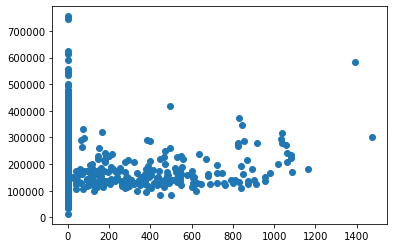

## Part 1: EDA

_Insert cells as needed below to write a short EDA/data section that summarizes the data for someone who has never opened it before._ 
- Answer essential questions about the dataset (observation units, time period, sample size, many of the questions above) 
- Note any issues you have with the data (variable X has problem Y that needs to get addressed before using it in regressions or a prediction model because Z)
- Present any visual results you think are interesting or important


```python
import pandas as pd
import numpy as np
import matplotlib.pyplot as plt
import seaborn as sns
from sklearn.preprocessing import StandardScaler
from statsmodels.formula.api import ols as sm_ols
from statsmodels.iolib.summary2 import summary_col # nicer tables

import warnings
warnings.filterwarnings('ignore')
%matplotlib inline
```


```python
housing=pd.read_csv('input_data2/housing_train.csv')
```


```python
housing.describe()
```


<div>
<style scoped>
    .dataframe tbody tr th:only-of-type {
        vertical-align: middle;
    }

    .dataframe tbody tr th {
        vertical-align: top;
    }

    .dataframe thead th {
        text-align: right;
    }
</style>
<table border="1" class="dataframe">
  <thead>
    <tr style="text-align: right;">
      <th></th>
      <th>v_MS_SubClass</th>
      <th>v_Lot_Frontage</th>
      <th>v_Lot_Area</th>
      <th>v_Overall_Qual</th>
      <th>v_Overall_Cond</th>
      <th>v_Year_Built</th>
      <th>v_Year_Remod/Add</th>
      <th>v_Mas_Vnr_Area</th>
      <th>v_BsmtFin_SF_1</th>
      <th>v_BsmtFin_SF_2</th>
      <th>...</th>
      <th>v_Wood_Deck_SF</th>
      <th>v_Open_Porch_SF</th>
      <th>v_Enclosed_Porch</th>
      <th>v_3Ssn_Porch</th>
      <th>v_Screen_Porch</th>
      <th>v_Pool_Area</th>
      <th>v_Misc_Val</th>
      <th>v_Mo_Sold</th>
      <th>v_Yr_Sold</th>
      <th>v_SalePrice</th>
    </tr>
  </thead>
  <tbody>
    <tr>
      <th>count</th>
      <td>1941.000000</td>
      <td>1620.000000</td>
      <td>1941.000000</td>
      <td>1941.000000</td>
      <td>1941.000000</td>
      <td>1941.000000</td>
      <td>1941.000000</td>
      <td>1923.000000</td>
      <td>1940.000000</td>
      <td>1940.000000</td>
      <td>...</td>
      <td>1941.000000</td>
      <td>1941.000000</td>
      <td>1941.000000</td>
      <td>1941.000000</td>
      <td>1941.000000</td>
      <td>1941.000000</td>
      <td>1941.000000</td>
      <td>1941.000000</td>
      <td>1941.000000</td>
      <td>1941.000000</td>
    </tr>
    <tr>
      <th>mean</th>
      <td>58.088614</td>
      <td>69.301235</td>
      <td>10284.770222</td>
      <td>6.113344</td>
      <td>5.568264</td>
      <td>1971.321999</td>
      <td>1984.073158</td>
      <td>104.846074</td>
      <td>436.986598</td>
      <td>49.247938</td>
      <td>...</td>
      <td>92.458011</td>
      <td>49.157135</td>
      <td>22.947965</td>
      <td>2.249871</td>
      <td>16.249871</td>
      <td>3.386399</td>
      <td>52.553838</td>
      <td>6.431221</td>
      <td>2006.998454</td>
      <td>182033.238022</td>
    </tr>
    <tr>
      <th>std</th>
      <td>42.946015</td>
      <td>23.978101</td>
      <td>7832.295527</td>
      <td>1.401594</td>
      <td>1.087465</td>
      <td>30.209933</td>
      <td>20.837338</td>
      <td>184.982611</td>
      <td>457.815715</td>
      <td>169.555232</td>
      <td>...</td>
      <td>127.020523</td>
      <td>70.296277</td>
      <td>65.249307</td>
      <td>22.416832</td>
      <td>56.748086</td>
      <td>43.695267</td>
      <td>616.064459</td>
      <td>2.745199</td>
      <td>0.801736</td>
      <td>80407.100395</td>
    </tr>
    <tr>
      <th>min</th>
      <td>20.000000</td>
      <td>21.000000</td>
      <td>1470.000000</td>
      <td>1.000000</td>
      <td>1.000000</td>
      <td>1872.000000</td>
      <td>1950.000000</td>
      <td>0.000000</td>
      <td>0.000000</td>
      <td>0.000000</td>
      <td>...</td>
      <td>0.000000</td>
      <td>0.000000</td>
      <td>0.000000</td>
      <td>0.000000</td>
      <td>0.000000</td>
      <td>0.000000</td>
      <td>0.000000</td>
      <td>1.000000</td>
      <td>2006.000000</td>
      <td>13100.000000</td>
    </tr>
    <tr>
      <th>25%</th>
      <td>20.000000</td>
      <td>58.000000</td>
      <td>7420.000000</td>
      <td>5.000000</td>
      <td>5.000000</td>
      <td>1953.000000</td>
      <td>1965.000000</td>
      <td>0.000000</td>
      <td>0.000000</td>
      <td>0.000000</td>
      <td>...</td>
      <td>0.000000</td>
      <td>0.000000</td>
      <td>0.000000</td>
      <td>0.000000</td>
      <td>0.000000</td>
      <td>0.000000</td>
      <td>0.000000</td>
      <td>5.000000</td>
      <td>2006.000000</td>
      <td>130000.000000</td>
    </tr>
    <tr>
      <th>50%</th>
      <td>50.000000</td>
      <td>68.000000</td>
      <td>9450.000000</td>
      <td>6.000000</td>
      <td>5.000000</td>
      <td>1973.000000</td>
      <td>1993.000000</td>
      <td>0.000000</td>
      <td>361.500000</td>
      <td>0.000000</td>
      <td>...</td>
      <td>0.000000</td>
      <td>28.000000</td>
      <td>0.000000</td>
      <td>0.000000</td>
      <td>0.000000</td>
      <td>0.000000</td>
      <td>0.000000</td>
      <td>6.000000</td>
      <td>2007.000000</td>
      <td>161900.000000</td>
    </tr>
    <tr>
      <th>75%</th>
      <td>70.000000</td>
      <td>80.000000</td>
      <td>11631.000000</td>
      <td>7.000000</td>
      <td>6.000000</td>
      <td>2001.000000</td>
      <td>2004.000000</td>
      <td>168.000000</td>
      <td>735.250000</td>
      <td>0.000000</td>
      <td>...</td>
      <td>168.000000</td>
      <td>72.000000</td>
      <td>0.000000</td>
      <td>0.000000</td>
      <td>0.000000</td>
      <td>0.000000</td>
      <td>0.000000</td>
      <td>8.000000</td>
      <td>2008.000000</td>
      <td>215000.000000</td>
    </tr>
    <tr>
      <th>max</th>
      <td>190.000000</td>
      <td>313.000000</td>
      <td>164660.000000</td>
      <td>10.000000</td>
      <td>9.000000</td>
      <td>2008.000000</td>
      <td>2009.000000</td>
      <td>1600.000000</td>
      <td>5644.000000</td>
      <td>1474.000000</td>
      <td>...</td>
      <td>1424.000000</td>
      <td>742.000000</td>
      <td>1012.000000</td>
      <td>407.000000</td>
      <td>576.000000</td>
      <td>800.000000</td>
      <td>17000.000000</td>
      <td>12.000000</td>
      <td>2008.000000</td>
      <td>755000.000000</td>
    </tr>
  </tbody>
</table>
<p>8 rows × 37 columns</p>
</div>


```python
housing.info()
```

    <class 'pandas.core.frame.DataFrame'>
    RangeIndex: 1941 entries, 0 to 1940
    Data columns (total 81 columns):
     #   Column             Non-Null Count  Dtype  
    ---  ------             --------------  -----  
     0   parcel             1941 non-null   object 
     1   v_MS_SubClass      1941 non-null   int64  
     2   v_MS_Zoning        1941 non-null   object 
     3   v_Lot_Frontage     1620 non-null   float64
     4   v_Lot_Area         1941 non-null   int64  
     5   v_Street           1941 non-null   object 
     6   v_Alley            136 non-null    object 
     7   v_Lot_Shape        1941 non-null   object 
     8   v_Land_Contour     1941 non-null   object 
     9   v_Utilities        1941 non-null   object 
     10  v_Lot_Config       1941 non-null   object 
     11  v_Land_Slope       1941 non-null   object 
     12  v_Neighborhood     1941 non-null   object 
     13  v_Condition_1      1941 non-null   object 
     14  v_Condition_2      1941 non-null   object 
     15  v_Bldg_Type        1941 non-null   object 
     16  v_House_Style      1941 non-null   object 
     17  v_Overall_Qual     1941 non-null   int64  
     18  v_Overall_Cond     1941 non-null   int64  
     19  v_Year_Built       1941 non-null   int64  
     20  v_Year_Remod/Add   1941 non-null   int64  
     21  v_Roof_Style       1941 non-null   object 
     22  v_Roof_Matl        1941 non-null   object 
     23  v_Exterior_1st     1941 non-null   object 
     24  v_Exterior_2nd     1941 non-null   object 
     25  v_Mas_Vnr_Type     1923 non-null   object 
     26  v_Mas_Vnr_Area     1923 non-null   float64
     27  v_Exter_Qual       1941 non-null   object 
     28  v_Exter_Cond       1941 non-null   object 
     29  v_Foundation       1941 non-null   object 
     30  v_Bsmt_Qual        1891 non-null   object 
     31  v_Bsmt_Cond        1891 non-null   object 
     32  v_Bsmt_Exposure    1889 non-null   object 
     33  v_BsmtFin_Type_1   1891 non-null   object 
     34  v_BsmtFin_SF_1     1940 non-null   float64
     35  v_BsmtFin_Type_2   1891 non-null   object 
     36  v_BsmtFin_SF_2     1940 non-null   float64
     37  v_Bsmt_Unf_SF      1940 non-null   float64
     38  v_Total_Bsmt_SF    1940 non-null   float64
     39  v_Heating          1941 non-null   object 
     40  v_Heating_QC       1941 non-null   object 
     41  v_Central_Air      1941 non-null   object 
     42  v_Electrical       1940 non-null   object 
     43  v_1st_Flr_SF       1941 non-null   int64  
     44  v_2nd_Flr_SF       1941 non-null   int64  
     45  v_Low_Qual_Fin_SF  1941 non-null   int64  
     46  v_Gr_Liv_Area      1941 non-null   int64  
     47  v_Bsmt_Full_Bath   1939 non-null   float64
     48  v_Bsmt_Half_Bath   1939 non-null   float64
     49  v_Full_Bath        1941 non-null   int64  
     50  v_Half_Bath        1941 non-null   int64  
     51  v_Bedroom_AbvGr    1941 non-null   int64  
     52  v_Kitchen_AbvGr    1941 non-null   int64  
     53  v_Kitchen_Qual     1941 non-null   object 
     54  v_TotRms_AbvGrd    1941 non-null   int64  
     55  v_Functional       1941 non-null   object 
     56  v_Fireplaces       1941 non-null   int64  
     57  v_Fireplace_Qu     1001 non-null   object 
     58  v_Garage_Type      1836 non-null   object 
     59  v_Garage_Yr_Blt    1834 non-null   float64
     60  v_Garage_Finish    1834 non-null   object 
     61  v_Garage_Cars      1940 non-null   float64
     62  v_Garage_Area      1940 non-null   float64
     63  v_Garage_Qual      1834 non-null   object 
     64  v_Garage_Cond      1834 non-null   object 
     65  v_Paved_Drive      1941 non-null   object 
     66  v_Wood_Deck_SF     1941 non-null   int64  
     67  v_Open_Porch_SF    1941 non-null   int64  
     68  v_Enclosed_Porch   1941 non-null   int64  
     69  v_3Ssn_Porch       1941 non-null   int64  
     70  v_Screen_Porch     1941 non-null   int64  
     71  v_Pool_Area        1941 non-null   int64  
     72  v_Pool_QC          13 non-null     object 
     73  v_Fence            365 non-null    object 
     74  v_Misc_Feature     63 non-null     object 
     75  v_Misc_Val         1941 non-null   int64  
     76  v_Mo_Sold          1941 non-null   int64  
     77  v_Yr_Sold          1941 non-null   int64  
     78  v_Sale_Type        1941 non-null   object 
     79  v_Sale_Condition   1941 non-null   object 
     80  v_SalePrice        1941 non-null   int64  
    dtypes: float64(11), int64(26), object(44)
    memory usage: 1.2+ MB
    


```python
housing.count()
```


    parcel              1941
    v_MS_SubClass       1941
    v_MS_Zoning         1941
    v_Lot_Frontage      1620
    v_Lot_Area          1941
                        ... 
    v_Mo_Sold           1941
    v_Yr_Sold           1941
    v_Sale_Type         1941
    v_Sale_Condition    1941
    v_SalePrice         1941
    Length: 81, dtype: int64


## Continuous variables:
v_Lot_Frontage, v_Lot_Area, v_Mas_Vnr_Area, v_BsmtFin_SF_1, v_BsmtFin_SF_2, v_Bsmt_Unf_SF, v_Total_Bsmt_SF, v_1st_Flr_SF, v_2nd_Flr_SF, v_Low_Qual_Fin_SF, v_Garage_Area, v_Wood_Deck_SF, v_Open_Porch_SF, v_Enclosed_Porch, v_3Ssn_Porch, v_Screen_Porc, v_Pool_Area, v_Misc_Val, v_SalesPrice

## Discrete variables:
v_Year_Built, v_Year_Remod/Add, v_Bsmt_Full_Bath, v_Bsmt_Half_Bath, v_Full_Bath, v_Half_Bath, v_Bedroom, v_Kitchen, v_Tot_Rms_Abv_Grd, v_Fireplaces, v_Garage_Yr_Blt, v_Garage_Cars, v_Mo_Sold, v_Yr_Sold, 

## categorical variables: 
v_MS_SubClass, v_MS_Zoning, v_Street, v_Lot_Shape, 
v_Land_Contour, v_Utilities, v_Lot_Config, v_Land_Slope, v_Neighborhood, v_Condition_1, v_Condition_2, v_Bldg_Type, v_House_Style, v_Roof_Style, v_Roof_Matl, v_Exterior_1st, v_Mas_Vnr_Type, v_Exter_Qual, v_Foundation, v_Bsmt_Qual, v_Bsmt_Cond, v_Bsmt_Exposure, v_BsmtFin_Type_1, v_BsmtFin_Type_2, v_Heating, v_Heating_QC, v_Central_Air, v_Electrical, v_Kitchen_Qual, v_Functional, v_Fireplace_Qu, v_Garage_Type, v_Garage_Finish, v_Garage_Qual, v_Garage_Cond, v_Paved_Drive, v_Pool_QC, v_Fence, v_Misc_Feature, v_Sale_Type, v_Sale_Condition


```python
from eda import insufficient_but_starting_eda
continuous_vars = ['v_Lot_Frontage', 'v_Lot_Area', 'v_Mas_Vnr_Area', 'v_BsmtFin_SF_1' , 'v_BsmtFin_SF_2', 'v_Bsmt_Unf_SF', 'v_Total_Bsmt_SF', 'v_1st_Flr_SF', 
                'v_2nd_Flr_SF', 'v_Low_Qual_Fin_SF', 'v_Gr_Liv_Area', 'v_Garage_Area', 'v_Wood_Deck_SF', 'v_Open_Porch_SF', 'v_Enclosed_Porch', 
                'v_3Ssn_Porch', 'v_Screen_Porch', 'v_Pool_Area', 'v_3Ssn_Porch', 'v_Screen_Porch', 'v_Pool_Area', 'v_Misc_Val','v_SalePrice']
insufficient_but_starting_eda(housing[continuous_vars],['v_SalePrice'])
```

       v_Lot_Frontage  v_Lot_Area  v_Mas_Vnr_Area  v_BsmtFin_SF_1  v_BsmtFin_SF_2  \
    0           107.0       13891           436.0          1400.0             0.0   
    1            98.0       12704           302.0          1012.0             0.0   
    2           114.0       14803           816.0          1636.0             0.0   
    3           126.0       13108             0.0             0.0             0.0   
    4            96.0       12444           426.0          1336.0             0.0   
    
       v_Bsmt_Unf_SF  v_Total_Bsmt_SF  v_1st_Flr_SF  v_2nd_Flr_SF  \
    0          310.0           1710.0          1710             0   
    1          570.0           1582.0          1582             0   
    2          442.0           2078.0          2084             0   
    3            0.0              0.0          1226             0   
    4          596.0           1932.0          1932             0   
    
       v_Low_Qual_Fin_SF  ...  v_Open_Porch_SF  v_Enclosed_Porch  v_3Ssn_Porch  \
    0                  0  ...              102                 0             0   
    1                  0  ...               95                 0             0   
    2                  0  ...               45                 0             0   
    3                  0  ...               24               120             0   
    4                  0  ...               66                 0           304   
    
       v_Screen_Porch  v_Pool_Area  v_3Ssn_Porch  v_Screen_Porch  v_Pool_Area  \
    0               0            0             0               0            0   
    1               0            0             0               0            0   
    2               0            0             0               0            0   
    3             228            0             0             228            0   
    4               0            0           304               0            0   
    
       v_Misc_Val  v_SalePrice  
    0           0       372402  
    1           0       317500  
    2           0       385000  
    3           0       153500  
    4           0       394617  
    
    [5 rows x 23 columns] 
    ---
          v_Lot_Frontage  v_Lot_Area  v_Mas_Vnr_Area  v_BsmtFin_SF_1  \
    1936            79.0       13110           144.0           962.0   
    1937             NaN        7082             0.0             0.0   
    1938            60.0       10800             0.0           664.0   
    1939            55.0        5687             0.0           210.0   
    1940            60.0       12900             0.0          1300.0   
    
          v_BsmtFin_SF_2  v_Bsmt_Unf_SF  v_Total_Bsmt_SF  v_1st_Flr_SF  \
    1936             0.0          191.0           1153.0          1193   
    1937             0.0          686.0            686.0           948   
    1938             0.0          290.0            954.0          1766   
    1939             0.0          570.0            780.0           936   
    1940             0.0            0.0           1300.0          1140   
    
          v_2nd_Flr_SF  v_Low_Qual_Fin_SF  ...  v_Open_Porch_SF  v_Enclosed_Porch  \
    1936             0                  0  ...              153                 0   
    1937           980                  0  ...                0               228   
    1938           648                  0  ...                0                 0   
    1939           780                  0  ...              184                 0   
    1940             0                  0  ...                0               190   
    
          v_3Ssn_Porch  v_Screen_Porch  v_Pool_Area  v_3Ssn_Porch  v_Screen_Porch  \
    1936             0               0            0             0               0   
    1937             0               0            0             0               0   
    1938             0               0            0             0               0   
    1939             0               0            0             0               0   
    1940             0               0            0             0               0   
    
          v_Pool_Area  v_Misc_Val  v_SalePrice  
    1936            0           0       146500  
    1937            0           0       160000  
    1938            0           0       160000  
    1939            0           0       135900  
    1940            0           0        95541  
    
    [5 rows x 23 columns] 
    ---
    Index(['v_Lot_Frontage', 'v_Lot_Area', 'v_Mas_Vnr_Area', 'v_BsmtFin_SF_1',
           'v_BsmtFin_SF_2', 'v_Bsmt_Unf_SF', 'v_Total_Bsmt_SF', 'v_1st_Flr_SF',
           'v_2nd_Flr_SF', 'v_Low_Qual_Fin_SF', 'v_Gr_Liv_Area', 'v_Garage_Area',
           'v_Wood_Deck_SF', 'v_Open_Porch_SF', 'v_Enclosed_Porch', 'v_3Ssn_Porch',
           'v_Screen_Porch', 'v_Pool_Area', 'v_3Ssn_Porch', 'v_Screen_Porch',
           'v_Pool_Area', 'v_Misc_Val', 'v_SalePrice'],
          dtype='object') 
    ---
    The shape is:  (1941, 23) 
    ---
    <class 'pandas.core.frame.DataFrame'>
    RangeIndex: 1941 entries, 0 to 1940
    Data columns (total 23 columns):
     #   Column             Non-Null Count  Dtype  
    ---  ------             --------------  -----  
     0   v_Lot_Frontage     1620 non-null   float64
     1   v_Lot_Area         1941 non-null   int64  
     2   v_Mas_Vnr_Area     1923 non-null   float64
     3   v_BsmtFin_SF_1     1940 non-null   float64
     4   v_BsmtFin_SF_2     1940 non-null   float64
     5   v_Bsmt_Unf_SF      1940 non-null   float64
     6   v_Total_Bsmt_SF    1940 non-null   float64
     7   v_1st_Flr_SF       1941 non-null   int64  
     8   v_2nd_Flr_SF       1941 non-null   int64  
     9   v_Low_Qual_Fin_SF  1941 non-null   int64  
     10  v_Gr_Liv_Area      1941 non-null   int64  
     11  v_Garage_Area      1940 non-null   float64
     12  v_Wood_Deck_SF     1941 non-null   int64  
     13  v_Open_Porch_SF    1941 non-null   int64  
     14  v_Enclosed_Porch   1941 non-null   int64  
     15  v_3Ssn_Porch       1941 non-null   int64  
     16  v_Screen_Porch     1941 non-null   int64  
     17  v_Pool_Area        1941 non-null   int64  
     18  v_3Ssn_Porch       1941 non-null   int64  
     19  v_Screen_Porch     1941 non-null   int64  
     20  v_Pool_Area        1941 non-null   int64  
     21  v_Misc_Val         1941 non-null   int64  
     22  v_SalePrice        1941 non-null   int64  
    dtypes: float64(7), int64(16)
    memory usage: 348.9 KB
    Info: None 
    ---
           v_Lot_Frontage     v_Lot_Area  v_Mas_Vnr_Area  v_BsmtFin_SF_1  \
    count     1620.000000    1941.000000     1923.000000     1940.000000   
    mean        69.301235   10284.770222      104.846074      436.986598   
    std         23.978101    7832.295527      184.982611      457.815715   
    min         21.000000    1470.000000        0.000000        0.000000   
    25%         58.000000    7420.000000        0.000000        0.000000   
    50%         68.000000    9450.000000        0.000000      361.500000   
    75%         80.000000   11631.000000      168.000000      735.250000   
    max        313.000000  164660.000000     1600.000000     5644.000000   
    
           v_BsmtFin_SF_2  v_Bsmt_Unf_SF  v_Total_Bsmt_SF  v_1st_Flr_SF  \
    count     1940.000000    1940.000000      1940.000000   1941.000000   
    mean        49.247938     567.437629      1053.672165   1161.071613   
    std        169.555232     439.600535       438.662147    396.945408   
    min          0.000000       0.000000         0.000000    334.000000   
    25%          0.000000     225.750000       796.750000    886.000000   
    50%          0.000000     474.000000       989.500000   1085.000000   
    75%          0.000000     815.000000      1295.250000   1383.000000   
    max       1474.000000    2153.000000      6110.000000   5095.000000   
    
           v_2nd_Flr_SF  v_Low_Qual_Fin_SF  ...  v_Open_Porch_SF  \
    count   1941.000000        1941.000000  ...      1941.000000   
    mean     340.955178           4.282329  ...        49.157135   
    std      434.242152          42.943917  ...        70.296277   
    min        0.000000           0.000000  ...         0.000000   
    25%        0.000000           0.000000  ...         0.000000   
    50%        0.000000           0.000000  ...        28.000000   
    75%      717.000000           0.000000  ...        72.000000   
    max     2065.000000         697.000000  ...       742.000000   
    
           v_Enclosed_Porch  v_3Ssn_Porch  v_Screen_Porch  v_Pool_Area  \
    count       1941.000000   1941.000000     1941.000000  1941.000000   
    mean          22.947965      2.249871       16.249871     3.386399   
    std           65.249307     22.416832       56.748086    43.695267   
    min            0.000000      0.000000        0.000000     0.000000   
    25%            0.000000      0.000000        0.000000     0.000000   
    50%            0.000000      0.000000        0.000000     0.000000   
    75%            0.000000      0.000000        0.000000     0.000000   
    max         1012.000000    407.000000      576.000000   800.000000   
    
           v_3Ssn_Porch  v_Screen_Porch  v_Pool_Area    v_Misc_Val    v_SalePrice  
    count   1941.000000     1941.000000  1941.000000   1941.000000    1941.000000  
    mean       2.249871       16.249871     3.386399     52.553838  182033.238022  
    std       22.416832       56.748086    43.695267    616.064459   80407.100395  
    min        0.000000        0.000000     0.000000      0.000000   13100.000000  
    25%        0.000000        0.000000     0.000000      0.000000  130000.000000  
    50%        0.000000        0.000000     0.000000      0.000000  161900.000000  
    75%        0.000000        0.000000     0.000000      0.000000  215000.000000  
    max      407.000000      576.000000   800.000000  17000.000000  755000.000000  
    
    [8 rows x 23 columns] 
    ---
    v_SalePrice has 820 values and its top 10 most common are:
    140000    26
    135000    23
    145000    21
    130000    21
    155000    18
    120000    16
    170000    15
    250000    14
    160000    14
    127000    14
    Name: v_SalePrice, dtype: int64 
    ---
    


```python
for var in continuous_vars:
    plt.scatter(housing[var], housing['v_SalePrice'])
    plt.show()
```


    

    


    

    


    

    


    

    


    

    


    

    


    

    


    

    


    

    


    

    


    

    


    

    


    

    


    

    


    

    


    

    


    

    


    

    


    

    


    

    


    

    


    

    


    

    


## Part 2: Running Regressions

**Run these regressions on the RAW data, even if you found data issues that you think should be addressed.**

_Insert cells as needed below to run these regressions. Note that $i$ is indexing a given house, and $t$ indexes the year of sale._ 

1. $\text{Sale Price}_{i,t} = \alpha + \beta_1 * \text{v_Lot_Area}$
1. $\text{Sale Price}_{i,t} = \alpha + \beta_1 * log(\text{v_Lot_Area})$
1. $log(\text{Sale Price}_{i,t}) = \alpha + \beta_1 * \text{v_Lot_Area}$
1. $log(\text{Sale Price}_{i,t}) = \alpha + \beta_1 * log(\text{v_Lot_Area})$
1. $log(\text{Sale Price}_{i,t}) = \alpha + \beta_1 * \text{v_Yr_Sold}$
1. $log(\text{Sale Price}_{i,t}) = \alpha + \beta_1 * (\text{v_Yr_Sold==2007})+ \beta_2 * (\text{v_Yr_Sold==2008})$
1. Choose your own adventure: Pick any five variables from the dataset that you think will generate good R2. Use them in a regression of $log(\text{Sale Price}_{i,t})$ 
    - Tip: You can transform/create these five variables however you want, even if it creates extra variables. For example: I'd count Model 6 above as only using one variable: `v_Yr_Sold`.
    - I got an R2 of 0.877 with just "5" variables. How close can you get? I won't be shocked if someone beats that!
    

**Bonus formatting trick:** Instead of reporting all regressions separately, report all seven regressions in a _single_ table using `summary_col`.


```python
housing = (housing
           .assign(l_v_Lot_Area = np.log(housing['v_Lot_Area']),
                   l_v_SalePrice = np.log(housing['v_SalePrice']),
                   const=1))
```


```python
reg1 = sm_ols('v_SalePrice ~ v_Lot_Area', data=housing).fit()
reg2 = sm_ols('v_SalePrice ~ l_v_Lot_Area', data=housing).fit()
reg3 = sm_ols('l_v_SalePrice ~ v_Lot_Area', data=housing).fit()
reg4 = sm_ols('l_v_SalePrice ~ l_v_Lot_Area', data=housing).fit()
reg5 = sm_ols('l_v_SalePrice ~ v_Yr_Sold', data=housing).fit()
reg6 = sm_ols('l_v_SalePrice ~ (v_Yr_Sold == 2007) + (v_Yr_Sold == 2008)', data=housing).fit()
reg7 = sm_ols('l_v_SalePrice ~ v_TotRms_AbvGrd + v_Sale_Condition + v_Neighborhood + v_Overall_Qual + v_Garage_Area', data=housing).fit()

```


```python
info_dict={'R-squared' : lambda x: f"{x.rsquared:.2f}",
           'Adj R-squared' : lambda x: f"{x.rsquared_adj:.2f}",
           'No. observations' : lambda x: f"{int(x.nobs):d}"}
```


```python
print('='*108)
print('                  y = interest rate if not specified, log(interest rate else)')
print(summary_col(results=[reg1,reg2,reg3,reg4,reg5,reg6,reg7], # list the result obj here
                  float_format='%0.4f',
                  stars = True, # stars are easy way to see if anything is statistically significant
                  model_names=['1','2',' 3(log) ','4(log) ','5','6','7'], # these are bad names, lol. Usually, just use the y variable name
                  info_dict=info_dict,
                  regressor_order=['Intercept','v_SalePrice', 'v_Lot_Area', 'l_v_Lot_Area', 'l_v_SalePrice', 'v_Yr_Sold', 'v_Yr_Sold==2007', 'v_Yr_Sold==2008', 'v_TotRms_AbvGr','v_Sale_Condition' , 'v_Neighborhood' , 'v_Overall_Qual' , 'v_Garage_Area']
                  )
     )
```

    ============================================================================================================
                      y = interest rate if not specified, log(interest rate else)
    
    ===============================================================================================================
                                      1               2          3(log)    4(log)       5         6          7     
    ---------------------------------------------------------------------------------------------------------------
    Intercept                   154789.5502*** -327915.8023*** 11.8941*** 9.4051*** 22.2932   12.0229*** 10.6995***
                                (2911.5906)    (30221.3471)    (0.0146)   (0.1511)  (22.9368) (0.0161)   (0.0513)  
    v_Lot_Area                  2.6489***                      0.0000***                                           
                                (0.2252)                       (0.0000)                                            
    l_v_Lot_Area                               56028.1700***              0.2883***                                
                                               (3315.1392)                (0.0166)                                 
    v_Yr_Sold                                                                       -0.0051                        
                                                                                    (0.0114)                       
    v_Overall_Qual                                                                                       0.1357*** 
                                                                                                         (0.0045)  
    v_Garage_Area                                                                                        0.0003*** 
                                                                                                         (0.0000)  
    v_Neighborhood[T.Veenker]                                                                            0.1597*** 
                                                                                                         (0.0548)  
    v_Neighborhood[T.NridgHt]                                                                            0.1219*** 
                                                                                                         (0.0424)  
    v_Neighborhood[T.OldTown]                                                                            -0.2050***
                                                                                                         (0.0421)  
    v_Neighborhood[T.SWISU]                                                                              -0.1006*  
                                                                                                         (0.0519)  
    v_Neighborhood[T.SawyerW]                                                                            0.0091    
                                                                                                         (0.0444)  
    v_Neighborhood[T.Sawyer]                                                                             -0.0547   
                                                                                                         (0.0432)  
    v_Neighborhood[T.Somerst]                                                                            0.0154    
                                                                                                         (0.0416)  
    v_Neighborhood[T.StoneBr]                                                                            0.1536*** 
                                                                                                         (0.0482)  
    v_Neighborhood[T.Timber]                                                                             0.1148**  
                                                                                                         (0.0457)  
    v_Neighborhood[T.NWAmes]                                                                             -0.0183   
                                                                                                         (0.0435)  
    v_Sale_Condition[T.AdjLand]                                                                          -0.0167   
                                                                                                         (0.0531)  
    v_Sale_Condition[T.Alloca]                                                                           0.0614    
                                                                                                         (0.0547)  
    v_Sale_Condition[T.Family]                                                                           0.0246    
                                                                                                         (0.0335)  
    v_Sale_Condition[T.Normal]                                                                           0.0787*** 
                                                                                                         (0.0160)  
    v_Sale_Condition[T.Partial]                                                                          0.1063*** 
                                                                                                         (0.0215)  
    v_TotRms_AbvGrd                                                                                      0.0461*** 
                                                                                                         (0.0029)  
    v_Yr_Sold == 2007[T.True]                                                                 0.0256               
                                                                                              (0.0222)             
    v_Neighborhood[T.NoRidge]                                                                            0.2015*** 
                                                                                                         (0.0470)  
    v_Neighborhood[T.NPkVill]                                                                            -0.1337*  
                                                                                                         (0.0694)  
    v_Neighborhood[T.Crawfor]                                                                            0.0996**  
                                                                                                         (0.0439)  
    v_Neighborhood[T.NAmes]                                                                              -0.0520   
                                                                                                         (0.0409)  
    v_Neighborhood[T.Blueste]                                                                            -0.1700*  
                                                                                                         (0.0944)  
    v_Neighborhood[T.BrDale]                                                                             -0.3725***
                                                                                                         (0.0544)  
    v_Neighborhood[T.BrkSide]                                                                            -0.1684***
                                                                                                         (0.0446)  
    v_Neighborhood[T.ClearCr]                                                                            0.1686*** 
                                                                                                         (0.0503)  
    v_Neighborhood[T.CollgCr]                                                                            0.0088    
                                                                                                         (0.0408)  
    v_Yr_Sold == 2008[T.True]                                                                 -0.0103              
                                                                                              (0.0228)             
    v_Neighborhood[T.Edwards]                                                                            -0.1140***
                                                                                                         (0.0426)  
    v_Neighborhood[T.Gilbert]                                                                            -0.0038   
                                                                                                         (0.0421)  
    v_Neighborhood[T.Greens]                                                                             -0.0410   
                                                                                                         (0.0866)  
    v_Neighborhood[T.GrnHill]                                                                            0.4661*** 
                                                                                                         (0.1277)  
    v_Neighborhood[T.IDOTRR]                                                                             -0.2803***
                                                                                                         (0.0451)  
    v_Neighborhood[T.Landmrk]                                                                            -0.1597   
                                                                                                         (0.1763)  
    v_Neighborhood[T.MeadowV]                                                                            -0.2102***
                                                                                                         (0.0530)  
    v_Neighborhood[T.Mitchel]                                                                            -0.0166   
                                                                                                         (0.0444)  
    R-squared                   0.0666         0.1284          0.0646     0.1350    0.0001    0.0014     0.8218    
    R-squared Adj.              0.0661         0.1279          0.0641     0.1345    -0.0004   0.0004     0.8186    
    R-squared                   0.07           0.13            0.06       0.13      0.00      0.00       0.82      
    Adj R-squared               0.07           0.13            0.06       0.13      -0.00     0.00       0.82      
    No. observations            1941           1941            1941       1941      1941      1941       1940      
    ===============================================================================================================
    Standard errors in parentheses.
    * p<.1, ** p<.05, ***p<.01
    

## Part 3: Regression interpretation

_Insert cells as needed below to answer these questions. Note that $i$ is indexing a given house, and $t$ indexes the year of sale._ 

1. If you didn't use the `summary_col` trick, list $\beta_1$ for Models 1-6 to make it easier on your graders.
1. Interpret $\beta_1$ in Model 2. 
1. Interpret $\beta_1$ in Model 3. 
    - HINT: You might need to print out more decimal places. Show at least 2 non-zero digits. 
1. Of models 1-4, which do you think best explains the data and why?
1. Interpret $\beta_1$ In Model 5
1. Interpret $\alpha$ in Model 6
1. Interpret $\beta_1$ in Model 6
1. Why is the R2 of Model 6 higher than the R2 of Model 5?
1. What variables did you include in Model 7?
1. What is the R2 of your Model 7?
1. Speculate (not graded): Could you use the specification of Model 6 in a predictive regression? 
1. Speculate (not graded): Could you use the specification of Model 5 in a predictive regression? 


```python
beta1=reg1.params[1]
beta2=reg2.params[1]
beta3=reg3.params[1]
beta4=reg4.params[1]
beta5=reg5.params[1]
beta6=reg6.params[1]
print(f"""
beta1:{beta1},
beta2:{beta2},
beta3:{beta3},
beta4:{beta4},
beta5:{beta5},
beta6:{beta6}
      """)
```

    
    beta1:2.64893500071819,
    beta2:56028.16996046535,
    beta3:1.3092338465836551e-05,
    beta4:0.28826331962293267,
    beta5:-0.005114348195977281,
    beta6:0.02559031997164772
          
    

**1.** "A 1% increase in log(v_Lot_Area) is associated with a increase of 560 in SalePrice."

**2.** "A 1% increase in Lot_Area is associated with a increase of 0.000013 in log(SalePrice)."

**4.** Model 4 is best explains the data, because model 4 have highest R-squared. 

**5.** Once the sold year add 1, the saleprice decrease 0.51%

**6.** the average value of log(SalePrice) is 12.02 for group 0

**7.** SalePrice is about 2.5% higher on average for cases when v_Yr_Sold==2007 than when v_Yr_Sold!=2007.

**8.** Because Model6 only have 2 categories, but Model5 is analysis lots of categories.

**9.** 'l_v_SalePrice ~ v_TotRms_AbvGrd + v_Sale_Condition + v_Neighborhood + v_Overall_Qual + v_Garage_Area'

**10.** 0.82
